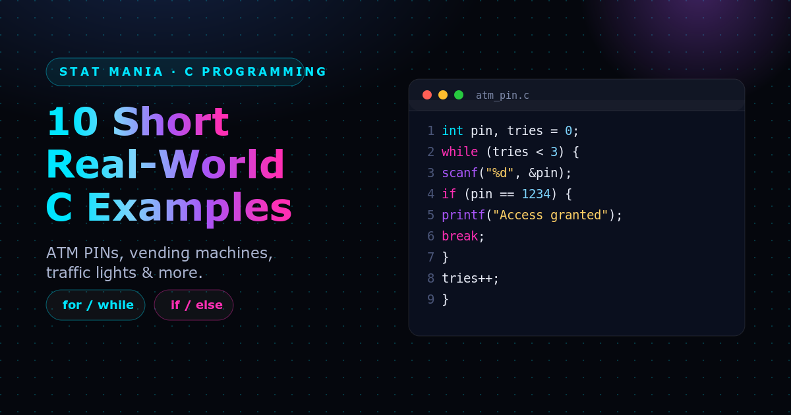

`if` and loops are the two building blocks behind almost every embedded and systems program you'll ever write in C: something happens repeatedly, and on each repetition you decide what to do. Here are 10 short, real-world examples — each with the problem it models and a quick walkthrough of the code.

### 1. ATM PIN Verification — Retry Up to 3 Times

**The problem:** An ATM shouldn't let someone guess a PIN forever. Give the user 3 attempts, then stop.

```c
int pin, tries = 0;
while (tries < 3) {
    scanf("%d", &pin);
    if (pin == 1234) { printf("Access granted"); break; }
    tries++;
}
```

**How it works:** The `while (tries < 3)` loop caps the attempts. Each pass reads a PIN and checks it with `if`; a correct guess prints a message and `break`s out immediately. A wrong guess falls through to `tries++`, and the loop simply ends on its own once `tries` hits 3 — there's no explicit "access denied" branch needed.

### 2. Temperature Control — Check Multiple Sensors

**The problem:** A server room or greenhouse has several temperature sensors, and any sensor reading too hot should switch on its own fan.

```c
for (int i = 0; i < 5; i++) {
    int temp = read_sensor(i);
    if (temp > 30) fan_on(i);
}
```

**How it works:** The `for` loop visits sensors `0` through `4` one at a time. `read_sensor(i)` fetches that sensor's reading, and the `if` decides — independently for each sensor — whether to call `fan_on(i)`. Nothing here depends on the other sensors, so a simple sequential scan is enough.

### 3. Password Retry — Keep Asking Until Correct

**The problem:** A login prompt that won't move on until the user types the right password — no attempt limit, just "try again."

```c
char pass[20];
do {
    scanf("%s", pass);
    if (strcmp(pass, "secret") == 0) break;
} while (1);
```

**How it works:** `do...while (1)` is a loop that always runs its body at least once and would otherwise repeat forever — the only way out is the `break` inside the `if`. `strcmp` returns `0` when two C strings are identical, so `strcmp(pass, "secret") == 0` is how C spells "the passwords match."

### 4. Traffic Light Timer — Switch When Time Expires

**The problem:** A traffic light needs to stay green until its timer runs out, then switch to yellow — checked continuously, forever.

```c
for (;;) {
    green_on();
    if (timer_expired()) { green_off(); yellow_on(); }
}
```

**How it works:** `for (;;)` is C's idiom for an infinite loop (all three parts of the `for` are left blank). Each pass keeps the green light on and asks `timer_expired()` whether it's time to move on; when it is, the `if` body turns green off and yellow on. A real controller would extend this with more states (yellow → red → green), but the pattern — infinite loop, `if` to notice a change — stays the same.

### 5. Vending Machine Change — Dispense Quarters

**The problem:** A vending machine owes a customer change and needs to dispense it as physical quarters, one at a time, until the amount owed drops below a quarter's value.

```c
while (change >= 25) {
    if (change >= 25) { dispense_quarter(); change -= 25; }
}
```

**How it works:** The loop condition and the `if` condition are the same test (`change >= 25`) — while that's redundant here (a plain `while` without the inner `if` would do the same job), it's a common defensive habit once the loop body grows and other conditions get added. Each pass dispenses one quarter and subtracts 25 (cents) from `change`, until there isn't enough left for another quarter.

### 6. Student Grade Calculator — Count Passes

**The problem:** Given a class of `n` students' marks, count how many passed (scored 40 or above).

```c
int pass = 0;
for (int i = 0; i < n; i++) {
    if (marks[i] >= 40) pass++;
}
```

**How it works:** This is the classic **filter-and-count** pattern: loop over every element of an array (`marks[i]` for `i` from `0` to `n - 1`), test each one with `if`, and increment a counter (`pass`) when it qualifies. The same shape works for counting anything — failing grades, over-budget items, expired records — just by changing the condition.

### 7. LED Blink Pattern — Read Bits of a Pattern

**The problem:** A hardware pattern like `0b10110010` should blink an LED on and off to match each bit, one bit at a time.

```c
for (int i = 0; i < 8; i++) {
    if (pattern & (1 << i)) led_on();
    else led_off();
    delay(200);
}
```

**How it works:** `1 << i` shifts the value `1` left by `i` bits, producing a mask with only bit `i` set (`00000001`, `00000010`, `00000100`, ...). `pattern & (1 << i)` keeps just that one bit from `pattern`; the result is non-zero (truthy) only if bit `i` was `1`. So the loop walks through all 8 bits of `pattern`, turning the LED on or off to match each one, with a `delay(200)` (milliseconds) so the blinking is visible.

### 8. Digital Clock — Roll Over Seconds to Minutes

**The problem:** A clock needs to tick once a second and carry seconds into minutes once they reach 60 — the same "carrying" logic behind every digital clock display.

```c
while (1) {
    delay(1000);
    sec++;
    if (sec == 60) { sec = 0; min++; }
}
```

**How it works:** `while (1)` ticks forever. Each iteration waits one second (`delay(1000)` milliseconds), then increments `sec`. The `if` catches the moment `sec` reaches 60 and resets it to `0` while bumping `min` — the same rollover a real clock would also need to apply to `min` rolling into `hour`.

### 9. Menu-Driven Calculator — Repeat Until Exit

**The problem:** A simple calculator menu that keeps prompting for a choice and performing it, until the user picks the "exit" option.

```c
int choice;
do {
    scanf("%d", &choice);
    if (choice == 1) printf("%d", a + b);
} while (choice != 0);
```

**How it works:** `do...while (choice != 0)` runs the menu at least once, then keeps looping as long as the user hasn't chosen `0` (exit). Inside, `if (choice == 1)` handles one menu option; a real program would follow it with `else if` branches for subtraction, multiplication, and so on, all guarded by the same loop.

### 10. Bank Withdrawal — Check Balance Before Deducting

**The problem:** A withdrawal should only go through if there's enough balance to cover it — otherwise, reject it and let the user try again.

```c
while (1) {
    scanf("%f", &amount);
    if (amount <= balance) balance -= amount;
    else printf("Insufficient funds");
}
```

**How it works:** Each pass through the infinite loop reads a requested `amount`. The `if`/`else` is the guard: if `amount` fits within `balance`, it's deducted; otherwise the request is rejected with a message and `balance` is left untouched. Note there's no way to leave this loop — a real version would add a "cancel" choice the same way Example 9 handles `choice == 0`.

---

These are simplified sketches, not production code — there's no input validation, and several of them (4, 8, 10) loop forever by design, the way an embedded device's main loop or a always-on hardware controller would. But the underlying shape repeats everywhere in C: **a loop for repetition, an `if` for decision-making.** Once that pattern is second nature, most short C programs are just variations on it.
