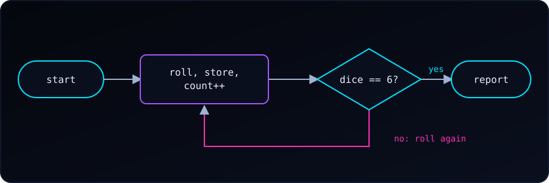

We are going to toss a die and track every output, while waiting for 6 to appear.

{fig-alt="Flowchart: roll the die, store the roll and count it; if the roll is not 6 roll again, otherwise report the number of steps."}

New to `srand(time(NULL))`? See [why it seeds the generator](c-srand-time-null.qmd) first. Each program below is hidden by default. Try it yourself first: open **See hint** if we get stuck, and press **Reveal** to check our answer.

### Track Every Roll

The simplest approach is to **print inside the loop**. This shows each roll as it happens:

::: {.reveal-code}
::: {.hint}
- Seed the generator once: `srand(time(NULL))`.
- Start with `dice = 0` and `count = 0`.
- Repeat while `dice != 6`:
- Roll: `dice = rand() % 6 + 1`.
- Add 1 to `count`.
- `printf` the step number and the roll.
- After the loop, print `count`.
:::

```c
#include <stdio.h>
#include <stdlib.h>
#include <time.h>

int main(void) {
    srand(time(NULL));

    int dice = 0;
    int count = 0;

    while (dice != 6) {
        dice = (rand() % 6) + 1;
        count++;
        printf("Step %d: rolled %d\n", count, dice);
    }

    printf("We have 6, in %d steps.\n", count);
    return 0;
}
```
:::

Example output:
```
Step 1: rolled 3
Step 2: rolled 1
Step 3: rolled 5
Step 4: rolled 6
We have 6, in 4 steps.
```

This is the fastest way to see each value. But it prints as it goes — you can't review the sequence afterward, and the numbers scroll past.

---

### Better: Store the Rolls in an Array

If you want to **keep the full history** and print it at the end (e.g., to analyze it), use an array:

::: {.reveal-code}
::: {.hint}
- Make an array `rolls[100]` and set `count = 0`, `dice = 0`.
- Repeat while `dice != 6` **and** `count < 100`:
- Roll the die.
- Save it: `rolls[count] = dice`.
- Add 1 to `count`.
- After the loop, a `for` loop from `0` to `count - 1` prints each stored roll.
- Print `count`.
:::

```c
#include <stdio.h>
#include <stdlib.h>
#include <time.h>

int main(void) {
    srand(time(NULL));

    int rolls[100];   // assume no more than 100 rolls
    int count = 0;
    int dice = 0;

    while (dice != 6 && count < 100) {
        dice = (rand() % 6) + 1;
        rolls[count] = dice;
        count++;
    }

    printf("Roll history: ");
    for (int i = 0; i < count; i++) {
        printf("%d", rolls[i]);
        if (i < count - 1) printf(", ");
    }
    printf("\n");

    printf("We have 6, in %d steps.\n", count);

    return 0;
}
```
:::

Example output:
```
Roll history: 3, 1, 5, 6
We have 6, in 4 steps.
```

**Why the `count < 100` check?** If `rand()` somehow never returns 6 (theoretically possible, practically absurd), the loop would run forever and overflow the array. This guards against that.

---

### Even Better: Tally the Frequencies

If your goal is to know **how many times each number appeared**, use an array indexed by the value:

::: {.reveal-code}
::: {.hint}
- Make `frequencies[7]`, all zeros (index 0 unused).
- Repeat while `dice != 6`:
- Roll the die.
- Tally it: `frequencies[dice]++`.
- Add 1 to `count`.
- After the loop, a `for` from face 1 to 6 prints `frequencies[face]`.
- Print `count`.
:::

```c
#include <stdio.h>
#include <stdlib.h>
#include <time.h>

int main(void) {
    srand(time(NULL));

    int frequencies[7] = {0};   // index 0 unused; counts for 1-6
    int count = 0;
    int dice = 0;

    while (dice != 6) {
        dice = (rand() % 6) + 1;
        frequencies[dice]++;
        count++;
    }

    printf("Roll frequencies:\n");
    for (int face = 1; face <= 6; face++) {
        printf("  %d: %d times\n", face, frequencies[face]);
    }
    printf("Total rolls: %d\n", count);

    return 0;
}
```
:::

Example output:
```
Roll frequencies:
  1: 2 times
  2: 0 times
  3: 1 times
  4: 0 times
  5: 1 times
  6: 1 times
Total rolls: 5
```

This is the pattern used constantly in data analysis — counting occurrences per category. In R this is `table()`; in Python it's `collections.Counter()`; in C you build it yourself with an array.

---

### The Note About `frequencies[7]`

You'll notice the array is size 7, not 6. That's because array indices in C start at 0, but dice faces are 1–6. So we waste index `[0]` and use indices `[1]` through `[6]`. This is a small, harmless price for readable indexing.

The alternative — `frequencies[dice - 1]` — packs the array to size 6 but means every access has a `-1` in it. Both are common; I prefer the size-7 version for clarity.

---

### Finally: Which Steps Gave Each Face?

Now we want more than counts: for each face, **which steps** produced it? We store the rolls in an array, then scan the array once per face and print the step numbers that match.

::: {.reveal-code}
::: {.hint}
- Store every roll in `rolls[]` as before; keep `count`.
- For each `face` from 1 to 6:
- Print the face.
- Scan `step` from 0 to `count - 1`.
- If `rolls[step] == face`, print `step + 1`.
- Print a newline before the next face.
:::

```c
#include <stdio.h>
#include <stdlib.h>
#include <time.h>

#define MAX_ROLLS 100

int main(void) {
    srand(time(NULL));

    int rolls[MAX_ROLLS];
    int count = 0;
    int dice = 0;

    while (dice != 6 && count < MAX_ROLLS) {
        dice = (rand() % 6) + 1;
        rolls[count] = dice;
        count++;
    }

    for (int face = 1; face <= 6; face++) {
        printf("%d:", face);
        for (int step = 0; step < count; step++) {
            if (rolls[step] == face) {
                printf(" %d", step + 1);
            }
        }
        printf("\n");
    }

    return 0;
}
```
:::

Example output:
```
1: 2
2: 3 4
3: 5
4:
5: 1
6: 6
```

Read it as: the first roll was a 5, the second a 1, the third and fourth were 2s, the fifth a 3, and the sixth finally gave the 6. A face that never appeared (here, 4) just gets an empty list.

The outer loop picks a face and the inner loop scans the history, so the work is `6 × count` comparisons. That is nothing for a die, but for many categories you would tally in one pass instead, as in the frequency array above.

---

### Which Approach to Choose?

| Goal | Use |
| :--- | :--- |
| Just see each roll as it happens | `printf` inside the loop |
| Store history to review/analyze later | Array of rolls |
| Count how often each face appears | Frequency array |
| Both history and frequency | Combine: store rolls in one array, tally in another |
| Which steps produced each face | Store the rolls, then scan once per face |
