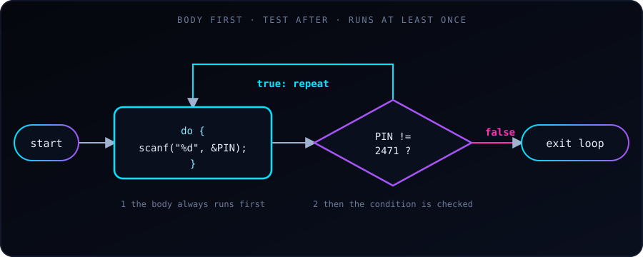

{fig-alt="Flowchart: the loop body runs, then the condition PIN != 2471 is tested. If true, control returns to the body; if false, the loop exits."}

Most loops check their condition **before** each pass. A `do-while` loop does the opposite: it runs the body first and checks the condition **afterwards**, so the body always runs **at least once**.

That makes it the natural choice whenever we need to do something before we can know whether to repeat it: asking for input, showing a menu, or retrying an action. Asking for a PIN is a perfect example, because we can't validate a PIN we haven't read yet.

The general form is:

```c
do {
    // body: runs at least once
} while (condition);   // note the semicolon
```

## Example 1: keep asking until the PIN is right

```c
#include <stdio.h>

int main(void) {
    int PIN;

    do {
        printf("Enter PIN\n");
        scanf("%d", &PIN);
    } while (PIN != 2471);

    printf("Correct PIN!\n");
    return 0;
}
```

A sample run:

```
Enter PIN
1111
Enter PIN
2471
Correct PIN!
```

The prompt appears once no matter what, and then again for as long as `PIN != 2471` is true. With an ordinary `while` loop we would have to give `PIN` a dummy starting value first just to get inside the loop. `do-while` avoids that.

## Example 2: limit the attempts

Real systems don't let anyone guess forever. Here we count attempts, leave early with `break` on success, and lock the account after 10 failures:

```c
#include <stdio.h>

int main(void) {
    int PIN;
    int attempts = 0;

    do {
        printf("Enter PIN: ");
        scanf("%d", &PIN);
        attempts++;

        if (PIN == 2471) {
            break;   // correct PIN: exit the loop early
        }

        if (attempts >= 10) {
            printf("Too many wrong attempts. Account locked.\n");
            return 1;   // exit the program with a failure code
        }

        printf("Wrong PIN. %d attempts left.\n", 10 - attempts);
    } while (1);   // loop "forever"; we leave via break or return

    printf("Correct PIN!\n");
    return 0;
}
```

A sample run (entering `1`, `2`, then the correct PIN):

```
Enter PIN: 1
Wrong PIN. 9 attempts left.
Enter PIN: 2
Wrong PIN. 8 attempts left.
Enter PIN: 2471
Correct PIN!
```

Here the condition is `while (1)`, which is always true, so the loop only ends through `break` (success) or `return` (locked out). We use `break` to leave just this loop and `return 1` to end the whole program with a non-zero exit code, the usual way to signal failure.

## do-while vs while

The only difference is **when the test happens**. Compare what happens when the condition is false from the start:

```c
int n = 10;

do {
    printf("do-while body, n = %d\n", n);   // runs once
} while (n < 5);

while (n < 5) {
    printf("while body\n");                 // never runs
}
```

Output:

```
do-while body, n = 10
```

| | `while` | `do-while` |
|---|---|---|
| Condition checked | Before each pass | After each pass |
| Minimum runs | 0 | 1 |
| Typical use | Loop while there is work to do | Ask/act first, then decide to repeat |

## Common pitfalls

- **Missing semicolon.** `do { ... } while (cond);` needs the `;` after the condition. Forgetting it is a compile error.
- **Bad input can loop forever.** If the user types a letter, `scanf("%d", ...)` fails and leaves the text in the input buffer, so the loop above may repeat endlessly. Real programs check `scanf`'s return value (it is `1` on success) and clear the buffer.
- **A condition that never becomes false.** Make sure something inside the body changes what the condition tests, or exit with `break`.
- **Using `do-while` when zero passes is valid.** If the loop should be skipped when there is nothing to do, use `while` or `for` instead.

## Key takeaway

`do-while` = **do the body, then decide whether to repeat**. Use it when the body must run at least once, such as prompts, menus and retry logic. Otherwise, `while` or `for` is usually clearer.
