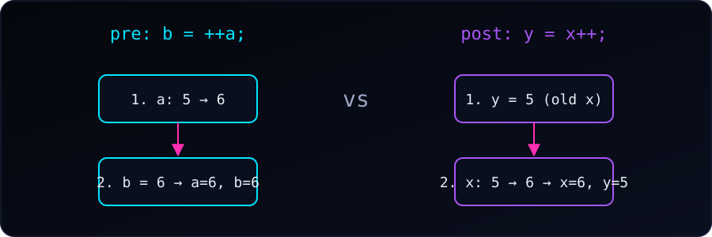

{fig-alt="Two columns. Pre-increment b = ++a: a goes from 5 to 6, then b is 6. Post-increment y = x++: y gets the old value 5, then x goes from 5 to 6."}

Both `++i` and `i++` add 1 to `i`. The difference is the **value the expression gives back**, which matters when we use it inside a larger expression:

- **Pre-increment (`++i`)** changes the value first, then returns the **new** value.
- **Post-increment (`i++`)** returns the **original** value first, then changes the value.

### Direct comparison

| Feature | Pre-increment (`++i`) | Post-increment (`i++`) |
|---|---|---|
| Syntax | `++variable;` | `variable++;` |
| Order | Increments, then evaluates | Evaluates, then increments |
| Value returned | The updated value | The original value |
| Precedence | Lower (prefix) | Higher (postfix) |

### 1. In assignments

When we assign the result to another variable, the order decides the final values:

```c
int a = 5;
int b = ++a;   // 'a' becomes 6, then 6 is assigned to 'b'
printf("a = %d, b = %d\n", a, b);

int x = 5;
int y = x++;   // 5 is assigned to 'y', then 'x' becomes 6
printf("x = %d, y = %d\n", x, y);
```

Output:

```
a = 6, b = 6
x = 6, y = 5
```

### 2. Inside `printf`

The timing changes what appears on the screen:

```c
int i = 10;
printf("%d\n", ++i);   // increments first, prints 11

int j = 10;
printf("%d\n", j++);   // prints the old value, 10
printf("%d\n", j);     // now j is 11
```

Output:

```
11
10
11
```

### 3. As a standalone statement

When the result is not used, there is no difference. `i` ends up as `i + 1` either way. This is why a `for` loop works the same with `i++` or `++i`:

```c
i++;   // i becomes i + 1
++i;   // i becomes i + 1
```

::: {.callout-warning}
## Don't change a variable twice in one expression

Statements such as `i = i++;` or `a[i] = i++;` modify and read `i` without a defined order, so their behaviour is **undefined** in C. We keep `++` and `--` to one use per variable in each expression.
:::

### Performance note

In C, a compiler produces the same code for a standalone `++i` and `i++`. In C++, pre-increment is usually preferred for iterators and other objects, because post-increment must make a temporary copy of the old value. So `++i` is a good habit to build early.

### Summary

- `++i`: update, then use the new value.
- `i++`: use the old value, then update.
- On their own they are identical; the difference shows up only when the result is used.

### References

- [UpGrad: pre-increment and post-increment in C](https://www.upgrad.com/tutorials/software-engineering/c-tutorial/pre-increment-and-post-increment-in-c/)
- [Scaler: pre-increment and post-increment in C](https://www.scaler.com/topics/pre-increment-and-post-increment-in-c/)
- [Reddit r/C_Programming: pre vs post increment](https://www.reddit.com/r/C_Programming/comments/m1f5kq/pre_vs_post_increment/)
- [DEV: unmasking the difference between ++i and i++](https://dev.to/galaxy233/unmasking-the-difference-pre-increment-i-vs-post-increment-i-in-c-39ok)
