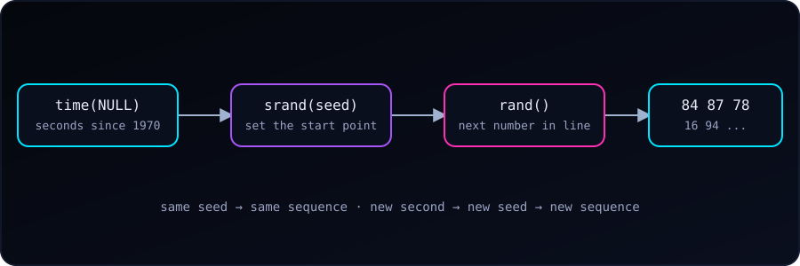

{fig-alt="Flow from time(NULL) to srand(seed) to rand() to a sequence of numbers. The same seed gives the same sequence; a new second gives a new seed and a new sequence."}

The line `srand(time(NULL));` appears at the top of almost every C program that needs random numbers, such as [the die-rolling example](c-die-throw.qmd). It is often copied without explanation. Let's see what each part does and what happens without it.

### The Surprise: `rand()` Is Not Random

`rand()` returns pseudo-random integers. "Pseudo" means they come from a formula: each number is computed from the previous one, starting at a **seed**. Same seed, same sequence, every time.

Let's roll five numbers from 1 to 100 without setting a seed:

```c
#include <stdio.h>
#include <stdlib.h>

int main(void) {
    for (int i = 0; i < 5; i++) {
        printf("%d ", rand() % 100 + 1);
    }
    printf("\n");
    return 0;
}
```

Running it twice:

```
84 87 78 16 94
84 87 78 16 94
```

Identical. When we never call `srand()`, C behaves as if we called `srand(1)`, so the program starts from the same point on every run.

::: {.callout-note}
The exact numbers depend on the C library. The ones in this post come from glibc (gcc on Linux). Another platform gives a different sequence, but it will still repeat from run to run.
:::

### The Parts, One at a Time

1. **`rand()`** returns the next number in the sequence. It has no memory of the clock; it only continues from its current state.
2. **`srand(seed)`** sets that starting state. It takes an `unsigned int`.
3. **`time(NULL)`** (from `<time.h>`) returns the current time as the number of seconds since 1 January 1970, the Unix epoch. This value changes every second, so each run starts from a different seed.

Together, `srand(time(NULL))` means "start the sequence from a point that depends on the clock."

### A Fixed Seed Is Useful Too

Passing a constant makes the sequence repeatable on purpose:

```c
srand(42);
```

Every run now prints `67 41 82 42 13`. That is exactly what we want when **testing or debugging**, or when a simulation must be reproducible. Print the seed, and anyone can replay the same run.

### Seeding with the Clock

Here is the usual form:

```c
#include <stdio.h>
#include <stdlib.h>
#include <time.h>

int main(void) {
    srand((unsigned int)time(NULL));

    for (int i = 0; i < 5; i++) {
        printf("%d ", rand() % 100 + 1);
    }
    printf("\n");
    return 0;
}
```

Two runs a second or more apart:

```
20 24 59 67 77
15 82 18 77 34
```

#### Why the `(unsigned int)` cast?

`time(NULL)` returns a `time_t`, usually a 64-bit integer, while `srand()` takes a 32-bit `unsigned int`. Passing one to the other narrows the value. With default warnings gcc stays quiet, but with `-Wconversion` it says:

```
warning: conversion from 'time_t' {aka 'long int'} to 'unsigned int' may change value [-Wconversion]
```

The cast says "yes, we know" and silences it. Losing the high bits is harmless here, since all we need is a number that differs from run to run.

### Pitfall 1: The Same-Second Trap

The clock only changes once per second. Two runs that start within the same second get the same seed, and therefore the same numbers. Running the program twice in a row from a script printed this:

```
20 24 59 67 77
20 24 59 67 77
```

For a game or a quick demo this rarely matters. For a program launched many times in a loop (a test harness, a batch job), it does.

### Pitfall 2: Seeding Inside a Loop

`srand()` belongs **once**, at the start of `main()`. Putting it inside the loop re-seeds with the same second again and again:

```c
for (int i = 0; i < 5; i++) {
    srand(time(NULL));              // wrong: restarts the sequence each pass
    printf("%d ", rand() % 100 + 1);
}
```

Output:

```
15 15 15 15 15
```

Every pass restarts the sequence from the same seed and takes its first number, so we get the same value five times.

### What `srand(time(NULL))` Cannot Do

- **It is not secure.** Anyone who knows roughly when the program ran can guess the seed. Never use `rand()` for passwords, tokens or cryptography; use the operating system's secure source instead (for example `getrandom()` on Linux or `arc4random()` on BSD and macOS).
- **It is not very uniform.** `rand() % 100` slightly favours small values, because `RAND_MAX + 1` is rarely a multiple of 100. For teaching and games this is fine.
- **In C++**, prefer `<random>` (`std::mt19937` with `std::random_device`) over `rand()`/`srand()`.

### Quick Summary

| Question | Answer |
| :--- | :--- |
| Why does `rand()` repeat across runs? | No `srand()` means the default seed 1 every time. |
| What does `time(NULL)` give? | Seconds since 1970, so a new seed each second. |
| Why cast to `unsigned int`? | `time_t` is wider; the cast avoids a `-Wconversion` warning. |
| How often do we call `srand()`? | Once, at the start of the program. |
| When do we use a fixed seed? | Testing, debugging, reproducible simulations. |
