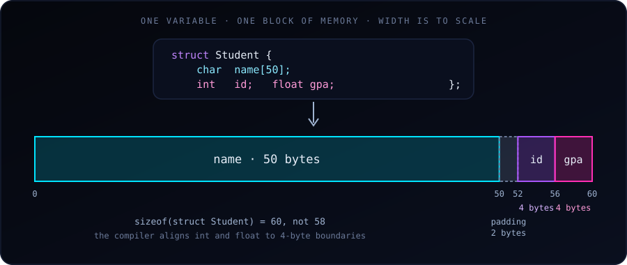

{fig-alt="A struct Student occupies 60 bytes: name uses 50, then 2 bytes of padding, then id uses 4 and gpa uses 4."}

A **struct** (short for "structure") lets you group **related variables of different types** into a single unit. It's the C way of saying "these pieces of data belong together."

This is something used more explicitly in R and Python. In Python, we'd write:

```python
student = {"name": "Alice", "id": 101, "gpa": 3.8}
```

In R:

```r
student <- list(name = "Alice", id = 101, gpa = 3.8)
```

In C, we use a **struct** to build this same idea — but with strict typing and a fixed layout.


### The Problem Structs Solve

Suppose you want to track a student's name, ID, and GPA. Without structs, you'd need three separate arrays:

```c
char names[100][50];
int ids[100];
float gpas[100];
```

This works, but it has problems:
- The data for one student is **scattered** across three arrays.
- If you pass a student to a function, you must pass three separate arguments.
- If you add a new field (say, `email`), you must update every function signature.
- It's easy to keep the arrays out of sync — e.g., swap `ids[3]` with `names[3]` accidentally.

A struct fixes all of this by keeping the fields together.


### Example 1: A Student Record

```c
#include <stdio.h>
#include <string.h>

struct Student {
    char name[50];
    int id;
    float gpa;
};

int main(void) {
    // Declare and initialize
    struct Student s1;
    strcpy(s1.name, "Alice");
    s1.id = 101;
    s1.gpa = 3.8;

    // Access and print
    printf("Name: %s\n", s1.name);
    printf("ID:   %d\n", s1.id);
    printf("GPA:  %.2f\n", s1.gpa);

    return 0;
}
```

Key points:

- `struct Student` defines a **new type**. It's a template — no memory is allocated until you declare a variable of that type.
- `s1` is a variable of type `struct Student`. It contains all three fields **contiguously in memory**.
- The `.` (dot) operator accesses individual fields: `s1.name`, `s1.id`, `s1.gpa`.
- The fields add up to `50 + 4 + 4 = 58` bytes, but `sizeof(struct Student)` is actually **60** on typical systems because of padding (see the diagram above and the gotchas below).


### Example 2: Multiple Students, Passed to a Function

This is where structs really shine — you can pass an entire record as one argument.

```c
#include <stdio.h>
#include <string.h>

struct Student {
    char name[50];
    int id;
    float gpa;
};

void printStudent(struct Student s) {
    printf("%-10s  ID: %3d  GPA: %.2f\n", s.name, s.id, s.gpa);
}

int main(void) {
    struct Student roster[3] = {
        {"Alice",   101, 3.8},
        {"Bob",     102, 3.2},
        {"Charlie", 103, 3.9}
    };

    for (int i = 0; i < 3; i++) {
        printStudent(roster[i]);
    }

    return 0;
}
```

Output:

```
Alice       ID: 101  GPA: 3.80
Bob         ID: 102  GPA: 3.20
Charlie     ID: 103  GPA: 3.90
```

Things to notice:

- An **array of structs** (`struct Student roster[3]`) is how you build a "table" of records. This is the C equivalent of a data frame with 3 rows.
- **Initializer syntax**: `{"Alice", 101, 3.8}` matches the fields in declaration order.
- `printStudent` takes one argument and prints all three fields. Compare this to a function that would need `char name[], int id, float gpa` as three separate parameters — structs are cleaner.


### Example 3: A Point in 2D Space

A simpler, more geometric example:

```c
#include <stdio.h>
#include <math.h>

struct Point {
    double x;
    double y;
};

double distance(struct Point a, struct Point b) {
    double dx = a.x - b.x;
    double dy = a.y - b.y;
    return sqrt(dx*dx + dy*dy);
}

int main(void) {
    struct Point p1 = {0.0, 0.0};
    struct Point p2 = {3.0, 4.0};

    printf("Distance = %.2f\n", distance(p1, p2));   // Distance = 5.00

    return 0;
}
```

Compile with `gcc point.c -o point -lm`: on many systems `sqrt` lives in the math library, which must be linked explicitly.

This is the pattern you'll use constantly in geometry, graphics, and simulation work. The `distance` function reads as "distance between two points" — much clearer than `distance(x1, y1, x2, y2)`.


### Example 4: A Linked List Node (Preview of What's Coming)

Structs become essential when you build data structures. A linked list node in C looks like this:

```c
struct Node {
    int data;
    struct Node *next;   // pointer to another Node
};
```

Notice the struct **contains a pointer to its own type**. This is how linked lists, trees, and graphs are built. You cannot do this with plain arrays. (The field must be a pointer to `struct Node`: a struct cannot contain itself by value.)


### Structs vs. Arrays

| Feature | Array | Struct |
| :--- | :--- | :--- |
| Holds elements of... | Same type | Different types |
| Access by... | Index (`arr[0]`) | Field name (`s.name`) |
| Size | Determined by element count | Sum of all field sizes |
| Purpose | List of similar items | One composite item |

A useful way to think about it:

> **Array = many of the same thing. Struct = one thing made of many parts.**

A `struct Student roster[30]` combines both: an array (many) of structs (composite).


### Structs vs. Python Dicts / R Lists

| C struct | Python dict | R list |
| :--- | :--- | :--- |
| Fields fixed at compile time | Keys added at runtime | Names can be added dynamically |
| Fields are typed | Values can be any type | Values can be any type |
| Access with `.` | Access with `[]` | Access with `$` or `[[]]` |
| Cannot store in a JSON-like flexible way | Very flexible | Very flexible |

The trade-off: structs are **rigid but fast and type-safe**. Python dicts and R lists are **flexible but slower and error-prone**. For performance-critical code (which C is used for), structs win.


### A Few Rules and Gotchas

1. **Always end with a semicolon.** `struct Student { ... };` — the semicolon after `}` is mandatory. Forgetting it is a common beginner error.

2. **You can use `typedef` to shorten the name:**
   ```c
   typedef struct {
       char name[50];
       int id;
       float gpa;
   } Student;

   Student s1;   // no "struct" prefix needed
   ```
   This is very common in modern C code. Most real-world C uses `typedef`.

3. **You cannot compare structs with `==`.** This won't work:
   ```c
   if (s1 == s2) { ... }   // compile error
   ```
   You must compare field by field, or use `memcmp` (with caution due to padding).

4. **Structs can be passed by value or by pointer.** Passing by value copies the whole struct (potentially many bytes). Passing by pointer avoids the copy:
   ```c
   void printStudent(struct Student *s) {
       printf("%s\n", s->name);   // note the -> operator
   }
   ```
   The `->` operator is shorthand for `(*s).name`. You'll see it everywhere once you start using pointers with structs.

5. **Memory padding.** The compiler may insert unused bytes between fields to align them properly. Here `sizeof(struct Student)` is 60 rather than 58: `name` ends at byte 50, but the `int` must start at a multiple of 4, so 2 bytes of padding are added (`id` at offset 52, `gpa` at 56). This usually doesn't matter, but it's why you shouldn't assume a struct's size is the sum of its field sizes.


### When Should You Use a Struct?

Use a struct whenever **two or more pieces of data logically belong together**:

- A point (x, y) or (x, y, z)
- A date (year, month, day)
- A student (name, id, gpa)
- A bank account (number, balance, owner)
- A network packet (source, destination, payload)
- A configuration (width, height, color depth)
- A complex number (real, imaginary)

If you find yourself passing the same set of variables to multiple functions, or keeping parallel arrays in sync, that's a signal you should define a struct.


### A Practical Summary

Start with Example 1 (student record) and Example 3 (point). Write them, compile them, run them. Then modify them:

- Add a new field to the Student struct (e.g., `char email[100]`) and update the print function.
- Write a function that takes two points and returns the midpoint (another struct Point).
- Build an array of 5 students and sort them by GPA.

Once you're comfortable with these, structs will become a natural tool for organizing your data, and you'll be ready for pointer-based data structures such as linked lists, trees and hash tables.
