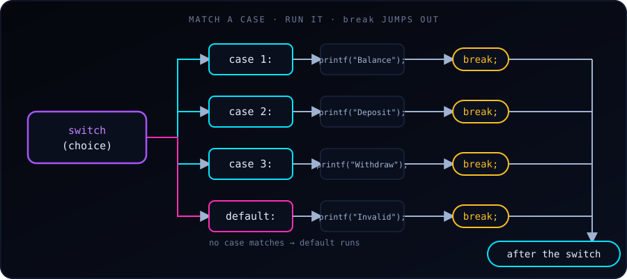

{fig-alt="Flowchart: switch (choice) is compared with case 1, case 2, case 3 and default. The matching case runs its statement, then break jumps to the code after the switch."}

A `switch` statement in C tests a variable or expression for equality against a list of values, called **cases**. It is a cleaner, more readable alternative to a long `if ... else if` chain when we handle several explicit paths.

## A simple example

```c
#include <stdio.h>

int main(void) {
    int toss = 1;

    switch (toss) {
        case 1:
            printf("Head\n");
            break;
        case 2:
            printf("Tail\n");
            break;
    }

    return 0;
}
```

Output:

```
Head
```

C evaluates `toss` once, jumps to the `case` whose value matches, and runs from there until it meets a `break`.

## Example 2: a menu

A menu selection is the classic use of `switch`:

```c
#include <stdio.h>

int main(void) {
    int choice;

    printf("--- Simple Menu ---\n");
    printf("1. Check Balance\n");
    printf("2. Deposit Money\n");
    printf("3. Withdraw Money\n");
    printf("Enter your choice (1-3): ");
    scanf("%d", &choice);

    // The switch expression must evaluate to an integer or character
    switch (choice) {
        case 1:
            printf("Your current balance is $1,500.\n");
            break;  // exits the switch block

        case 2:
            printf("Enter the amount you wish to deposit.\n");
            break;

        case 3:
            printf("Enter the amount you wish to withdraw.\n");
            break;

        default:
            // Runs if 'choice' doesn't match any case above
            printf("Invalid selection! Please enter a number between 1 and 3.\n");
            break;
    }

    return 0;
}
```

Sample run (entering `2`):

```
--- Simple Menu ---
1. Check Balance
2. Deposit Money
3. Withdraw Money
Enter your choice (1-3): 2
Enter the amount you wish to deposit.
```

## Key rules and syntax components

- **Expression type.** The expression inside `switch ( )` must have an integer type: `int`, `char`, `short`, `long` or an `enum`. We cannot switch on a `float`, a `double` or a string (`char *`).
- **Constant cases.** Each `case` value must be a constant expression, such as `5`, `'A'` or `2 + 3`. Variables are not allowed in case labels, and two cases cannot have the same value.
- **The `break` statement.** `break` jumps out of the whole `switch`. If we leave it out, execution **falls through** into the next case and runs its code, even though that case doesn't match.
- **The `default` case.** It runs when no `case` matches. It is optional, but we should almost always include it to catch unexpected input. By convention it goes last.

## Fall-through: the classic bug (and a useful trick)

Forgetting `break` is the most common `switch` mistake:

```c
int n = 1;

switch (n) {
    case 1:
        printf("one\n");      // no break!
    case 2:
        printf("two\n");      // runs too
    case 3:
        printf("three\n");    // and this
        break;
    default:
        printf("other\n");
}
```

Output:

```
one
two
three
```

The match is `case 1`, but with no `break` the program keeps running through `case 2` and `case 3` until the first `break`. Compiling with `-Wall -Wextra` (or `-Wimplicit-fallthrough`) makes GCC warn about this.

Fall-through can also be **useful on purpose**, to give several cases the same code. Here we simply leave the shared cases empty:

```c
char grade = 'B';

switch (grade) {
    case 'A':
    case 'B':
        printf("Good\n");     // A and B share this
        break;
    case 'C':
        printf("Okay\n");
        break;
    default:
        printf("Unknown grade\n");
}
```

Output: `Good`. When fall-through is intentional and the cases *do* contain code, add a comment such as `/* fall through */` (or the `[[fallthrough]];` attribute in C23) so the next reader knows it isn't a mistake.

## switch with characters and enums

Characters are integers in C, so `case 'A'` works. `enum` values are a natural fit as well, since the compiler can warn if we forget one:

```c
#include <stdio.h>

enum Color { RED, GREEN, BLUE };

int main(void) {
    enum Color c = GREEN;

    switch (c) {
        case RED:   puts("red");   break;
        case GREEN: puts("green"); break;
        case BLUE:  puts("blue");  break;
    }
    return 0;
}
```

This prints `green`. If we later add `YELLOW` to the enum and don't handle it, `-Wall` will warn that the switch doesn't cover all values (when there is no `default`).

## Declaring variables inside a case

A `case` label is not a block, so declaring a variable directly after one can fail to compile in older C standards, and the variable's scope covers the later cases. Wrap the case body in braces:

```c
switch (x) {
    case 2: {
        int square = x * x;
        printf("%d\n", square);
        break;
    }
    default:
        break;
}
```

## switch or if / else if?

| Use `switch` when... | Use `if / else if` when... |
|---|---|
| We compare **one value** against several **exact constants** | Conditions are **ranges** (`score >= 90`) |
| Values are integers, characters or enums | We compare floats or strings |
| We want many branches to read cleanly (menus, commands, states) | Conditions combine several variables (`a > b && c == 0`) |

A range such as "grade from a score" is a job for `if / else if` (see [10 Real-World `if / else` Examples in C](10-c-if-else-examples.html)), while a menu or a traffic-light state fits `switch` well.

## Common mistakes

1. Forgetting `break` and getting unwanted fall-through.
2. Switching on a `float`, `double` or string, which is a compile error.
3. Using a variable as a case label, also a compile error (`case a:` where `a` is a variable).
4. Omitting `default`, so bad input is silently ignored.
5. Putting `;` after a case value: it must be `case 1:`, with a colon.

## Key takeaway

`switch` evaluates an integer expression once and jumps straight to the matching `case`. Remember `break` after each case unless we deliberately want fall-through, and always add a `default` for input we didn't expect.
