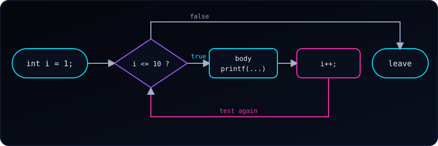

{fig-alt="Flowchart: int i = 1, then test i <= 10. If true, run the body and i++, then test again. If false, leave the loop."}

Five problems, from easy to medium, to build confidence with the `while` loop. Try each one on paper or in your editor first. If we get stuck, open **See hint** for the steps, and press **Reveal code** to compare with a tested solution.

Every solution was compiled with `gcc -Wall -Wextra` and run; the outputs shown are real. For a refresher, see [the do-while loop](c-do-while.qmd).

::: {.callout-note}
**The loop recipe.** Almost every `while` solution has three parts: (1) a variable set **before** the loop, (2) a condition that is tested **each time**, and (3) a line **inside** the loop that moves the variable toward making the condition false. Forget the third and the loop never ends.
:::

---

### Problem 1 (Easy): Print Even Numbers

Write a program that uses a `while` loop to print all even numbers from 2 up to 10 (inclusive).

Expected output:
```
2 4 6 8 10
```

::: {.reveal-code}
::: {.hint}
- Start a counter at the first even number: `i = 2`.
- Repeat while `i <= 10`.
- Print `i` inside the loop.
- Add 2 to `i`, not 1, to land on the next even number.
:::

```c
#include <stdio.h>

int main(void) {
    int i = 2;                  // the first even number
    while (i <= 10) {
        printf("%d ", i);
        i += 2;                 // jump to the next even number
    }
    printf("\n");
    return 0;
}
```
:::

**Try next:** print the even numbers from 10 down to 2.

---

### Problem 2 (Easy): Multiplication Table

Write a program that uses a `while` loop to print the multiplication table of 5, from 5 × 1 to 5 × 10.

Expected output (first and last lines):
```
5 x 1 = 5
...
5 x 10 = 50
```

::: {.reveal-code}
::: {.hint}
- Keep the table number in `num = 5`.
- Start a counter at `i = 1`.
- Repeat while `i <= 10`.
- Print `num`, `i` and `num * i` in one `printf`.
- Add 1 to `i`.
:::

```c
#include <stdio.h>

int main(void) {
    int num = 5;
    int i = 1;
    while (i <= 10) {
        printf("%d x %d = %d\n", num, i, num * i);
        i++;
    }
    return 0;
}
```
:::

**Try next:** read `num` with `scanf` so the program prints any table.

---

### Problem 3 (Medium): Factorial Calculator

Write a program that reads a number from the user and uses a `while` loop to compute its factorial. For example, 5! = 5 × 4 × 3 × 2 × 1 = 120.

Example run:
```
Enter a number: 5
5! = 120
```

::: {.reveal-code}
::: {.hint}
- Read `num` with `scanf`; reject negative input.
- Start a result at `factorial = 1` (use `long long`, since factorials grow fast).
- Copy the input into a counter: `i = num`.
- Repeat while `i > 1`.
- Multiply: `factorial *= i`, then `i--`.
- Print `factorial` after the loop.
:::

```c
#include <stdio.h>

int main(void) {
    int num;
    printf("Enter a number: ");
    if (scanf("%d", &num) != 1 || num < 0) {
        printf("Please enter a non-negative integer.\n");
        return 1;
    }

    long long factorial = 1;
    int i = num;
    while (i > 1) {             // multiplying by 1 changes nothing
        factorial *= i;
        i--;
    }
    printf("%d! = %lld\n", num, factorial);
    return 0;
}
```
:::

Runs with different inputs:

```
Enter a number: 0
0! = 1
Enter a number: 20
20! = 2432902008176640000
Enter a number: 21
21! = -4249290049419214848
```

Two things to notice. `0! = 1` works because the loop body never runs and the result stays 1. And **21! overflows** even `long long` (the largest factorial that fits is 20!), so the printed value is garbage. A real program should check for this.

**Try next:** stop with a message if `num` is greater than 20.

---

### Problem 4 (Medium): Reverse a Number

Write a program that reads an integer such as 1234 and uses a `while` loop to print it reversed (4321).

Example run:
```
Enter an integer: 1234
Reversed: 4321
```

::: {.reveal-code}
::: {.hint}
- Start with `reversed = 0`.
- Repeat while `num != 0`.
- Get the last digit: `digit = num % 10`.
- Append it: `reversed = reversed * 10 + digit`.
- Drop it from the input: `num /= 10`.
- Print `reversed` after the loop.
:::

```c
#include <stdio.h>

int main(void) {
    int num;
    printf("Enter an integer: ");
    scanf("%d", &num);

    int reversed = 0;
    while (num != 0) {
        int digit = num % 10;               // last digit
        reversed = reversed * 10 + digit;   // append it to the result
        num /= 10;                          // drop it from num
    }
    printf("Reversed: %d\n", reversed);
    return 0;
}
```
:::

Let's trace `1234`:

| `num` | `digit` | `reversed` |
| ---: | ---: | ---: |
| 1234 | 4 | 4 |
| 123 | 3 | 43 |
| 12 | 2 | 432 |
| 1 | 1 | 4321 |
| 0 | loop ends | 4321 |

Edge cases from real runs:

```
Enter an integer: 1200
Reversed: 21
Enter an integer: -45
Reversed: -54
```

Trailing zeros disappear (`1200` becomes `21`), because a number cannot have leading zeros. Negative numbers work, since `%` and `/` keep the sign in C. To keep the zeros, treat the input as a string instead.

**Try next:** use the same loop to check whether a number is a palindrome.

---

### Problem 5 (Medium): Count Digits

Write a program that uses a `while` loop to count the digits of an integer entered by the user (4502 has 4 digits).

Example run:
```
Enter an integer: 4502
4502 has 4 digit(s)
```

::: {.reveal-code}
::: {.hint}
- Copy the input into `temp` so `num` stays intact for printing.
- Start `count = 0`.
- Special case: if `temp == 0`, set `count = 1`.
- Repeat while `temp != 0`: divide `temp` by 10 and add 1 to `count`.
- Print `count`.
:::

```c
#include <stdio.h>

int main(void) {
    int num;
    printf("Enter an integer: ");
    scanf("%d", &num);

    int count = 0;
    int temp = num;
    if (temp == 0) {
        count = 1;              // 0 has one digit, but the loop below would skip it
    }
    while (temp != 0) {
        temp /= 10;
        count++;
    }
    printf("%d has %d digit(s)\n", num, count);
    return 0;
}
```
:::

The special case matters: for `0` the condition `temp != 0` is false at once, so without the `if` we would print 0 digits. Negative numbers work too (`-987` has 3 digits), because dividing by 10 moves a negative number toward 0 as well.

**Try next:** compute the sum of the digits instead of the count.

---

### What These Problems Practise

| Problem | Pattern |
| :--- | :--- |
| 1. Even numbers | Counting with a step other than 1 |
| 2. Multiplication table | A counter used inside a calculation |
| 3. Factorial | An accumulator that multiplies |
| 4. Reverse a number | Peeling digits with `%` and `/` |
| 5. Count digits | A counter that runs until the value reaches 0 |
