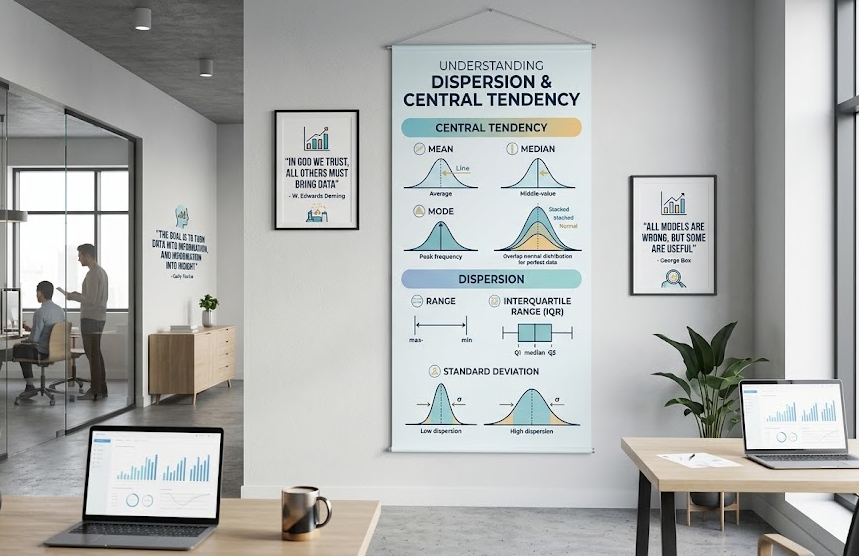

The **mean** and **median** answer "what's typical?" They do not answer "how much can I trust that number?" Two datasets can share the exact same average and still behave completely differently in practice. That gap is what **dispersion** — variance, standard deviation, range, IQR — measures.

## A Minimal Example

Consider two delivery services, both averaging **30 minutes** per delivery:

- **Service A**: 28, 29, 30, 31, 32 minutes
- **Service B**: 5, 15, 30, 45, 55 minutes

Same mean. Service A is predictable — every delivery lands within a couple of minutes of the average. Service B is a gamble — you might get your order in 5 minutes or wait almost an hour. A customer who only sees "average delivery time: 30 minutes" has no way to tell these two services apart, even though they represent very different experiences.

## Why This Matters in Practice

### 1. Salary and Compensation Reports

A company reporting "average salary: \$80,000" could mean everyone earns close to \$80K, or it could mean a handful of executives earn \$500K while most staff earn \$45K. The mean is identical in both cases; the standard deviation (or better, the IQR, which resists distortion by the executives' salaries) tells you which situation you're actually in.

### 2. Medical Test Results and Drug Trials

If a new blood-pressure medication reduces the average reading by 15 points, that sounds like a win. But if the *variance* in response is huge — some patients drop 40 points, others don't move at all, and a few even increase — the drug isn't reliably effective, it's unpredictable. Regulators and doctors care about consistency of effect, not just the average effect.

### 3. Manufacturing and Quality Control

A factory producing bolts with an average diameter of 10mm is only useful information if the spread is tiny. If the standard deviation is large, some bolts will be too loose and others too tight to fit, even though the average is exactly on target. This is the entire premise behind **Six Sigma** and control charts — they monitor spread, not just the mean, because a shift in the mean is often less dangerous than a blow-up in variance.

### 4. Investment Returns

Two mutual funds might both average **8% annual return** over ten years. Fund A moves steadily between 6–10% each year. Fund B swings between −20% and +35%. An investor nearing retirement cares enormously about that difference — it's the difference between a fund you can rely on and one that could wipe out your savings the year before you need the money. This is why finance uses standard deviation directly as a measure of *risk*, not just as a side statistic.

### 5. Exam Score Interpretation

A class average of 75% could mean most students clustered around 70–80%, or it could mean half the class scored 95% and the other half scored 55%. A teacher deciding whether to re-teach a topic needs the spread, not just the average — a bimodal distribution with a "good average" can hide a group that's completely lost.

## The Takeaway

Central tendency tells you where the data is centered. Dispersion tells you how much you can trust that center as a description of any single observation. Reporting a mean or median without a companion measure of spread — variance, standard deviation, IQR, or range — is like giving someone a destination without telling them how far off the road they might drift getting there. Whenever a number is used to make a decision — pricing, medicine, quality control, investing, grading — the spread around that number is often more decision-relevant than the number itself.
