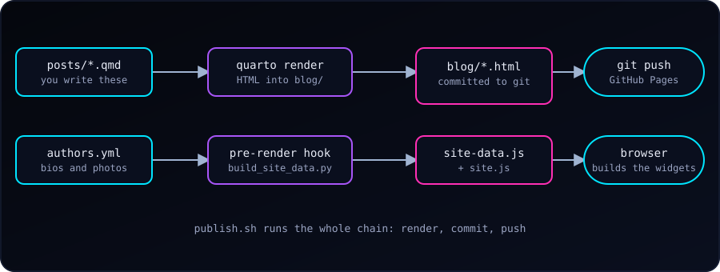

{fig-alt="Posts and authors.yml feed quarto render and a pre-render hook. Rendering writes blog/*.html, the hook writes site-data.js and site.js. Git push publishes to GitHub Pages and the browser builds the widgets from site-data.js."}

This blog is plain files: Markdown in, HTML out, hosted for free on GitHub Pages. There is no server and no database, yet it has a sidebar archive, a tag cloud, related posts, author pages, a light/dark switch, and a one-command publish. Here is how it fits together, so we can borrow whatever is useful.

### The Idea: Sources In, Built Site Out

Quarto turns `.qmd` files into HTML. GitHub Pages serves whatever is committed. So we keep two folders side by side:

```
blograw/          # sources (what we edit)
  _quarto.yml     # project config
  posts/*.qmd     # one file per post
  styles.css, site.js, authors.yml, publish.sh
blog/             # built site (generated; committed; served by Pages)
```

Nothing is built on GitHub. We render on our own computer and commit the result. The cost is that generated HTML lives in git. The gain is zero build infrastructure and a site that works with any static host.

The project file points Quarto at the right inputs and output:

```yaml
project:
  type: website
  render:
    - "*.qmd"
    - "posts/*.qmd"
  output-dir: ../blog
  pre-render: scripts/build_site_data.py
```

Each post starts with front matter that everything else reads:

```yaml
---
title: "Descriptive Title"
description: "One or two sentences for cards and search results."
date: "2026-10-04"
categories: [Tools, Quarto]       # broad
tags: [quarto, shell]             # specific
author: "Abdullah Al Mahmud"
image: ../img/cover.png
---
```

The homepage is a Quarto *listing*: a few lines in `index.qmd` give us a card grid, sorting, filtering, pagination and an RSS feed.

```yaml
listing:
  contents: posts
  sort: "date desc"
  type: grid
  categories: cloud
  page-size: 12
  feed: true
```

### The Problem: Cross-Post Features

A listing page knows all the posts. A **post page** only knows itself, so an archive in its sidebar, related posts, or a tag cloud would need data about every other post. If we bake that into each page at render time, adding one post leaves 40 old pages stale until we re-render them all (about a minute here).

### The Fix: One Data File, Rebuilt on Every Render

Quarto can run a script **before** every render with `pre-render:`. Ours is about 100 lines of Python. It reads the front matter of every post (and a small `authors.yml`) and writes one file:

```js
window.SM_DATA = {"posts":[{"href":"posts/c-struct.html","title":"…","date":"2026-08-20",
                            "tags":["c","struct"],"cats":["C"],"author":"…"}, …],
                  "authors":{…}};
```

The core of the hook is only this:

```python
for path in sorted(POSTS.glob("*.qmd")):
    fm = front_matter(path)            # YAML between the --- lines
    if fm.get("draft"):
        continue
    posts.append({"href": f"posts/{path.stem}.html", "title": fm["title"],
                  "date": as_date(fm["date"]).isoformat(),
                  "tags": as_list(fm.get("tags")), …})
(OUT_DIR / "site-data.js").write_text("window.SM_DATA=" + json.dumps(data) + ";")
```

A small hand-written `site.js` is loaded on every page. It reads `SM_DATA` and builds, in the browser:

- the **archive** (year, month, posts) and the **tag cloud** in the sidebar,
- a **Tags** row and up to five **Related posts** under each post,
- the **author card** and clickable author names,
- the **tags page** (`tags.html#tag=quarto`) and **author pages**, with filters and pagination.

Because the data file is rewritten by *any* render, even `quarto render posts/new-post.qmd` (about seven seconds) updates every widget on every page. No other page is re-rendered.

Related posts are scored in a few lines. A shared tag counts for more when few posts have it (a rare tag says more than "Tutorial"):

```js
// df = how many posts carry each tag or category; n = number of posts
score += Math.log(n / df[feature]) * (feature.startsWith('cat:') ? 0.5 : 1);
```

::: {.callout-note}
**Why `site-data.js` and not a JSON file?** Our first version fetched `site-data.json`. Browsers block `fetch()` for pages opened straight from disk (`file://`), so every widget vanished locally. A `<script src>` works everywhere, so the data became a `.js` file that sets a global.
:::

### Dark and Light Theme

Quarto adds a navbar toggle when `theme:` has a `light` and a `dark` entry:

```yaml
format:
  html:
    theme:
      dark: [cosmo, theme-dark.scss]
      light: cosmo
    highlight-style: {light: github, dark: dracula}
```

Two lessons. Listing `dark` first makes it the default. And Quarto decides what is dark from the theme's **background colour**: giving it `cosmo` twice looked fine but made *both* modes "light". The tiny `theme-dark.scss` only sets `$body-bg: #05070d;`, which is enough to make Quarto treat it as dark. After that, our stylesheet uses CSS variables (`--sm-bg`, `--sm-text`, …) and overrides them under `body.quarto-light`.

### Small Quality-of-Life Pieces

- **Reveal/Hide code with hints** for exercise posts. In Markdown we write a Pandoc div, and a tiny script adds the "See hint" and "Reveal code" buttons:

````markdown
::: {.reveal-code}
::: {.hint}
- Start `i` at 2
- Add 2 each pass
:::

```c
int i = 2;
while (i <= 10) { printf("%d ", i); i += 2; }
```
:::
````

  Without JavaScript the code and hint simply stay visible.

- **Images:** SVG in the post body (sharp, tiny, accessible), PNG in the front matter, because link previews on social sites do not render SVG.
- **Authors** live in one `authors.yml` (name, photo, bio). Posts keep `author: "Name"` as plain text, so nothing in old posts changes.

### The Publish Script

Rendering, committing and pushing is the same every time, so a short shell script does it:

```bash
#!/usr/bin/env bash
set -euo pipefail

for f in "${files[@]}"; do
  quarto render "$f"              # quarto renders one file per call
done

git add blog blograw              # only the blog; other changes stay untouched
git diff --cached --quiet && { echo "Nothing to commit."; exit 0; }
git commit -q -m "Blog: update $names"
git pull --rebase --autostash -q
git push
```

Day to day it is one line:

```
./publish.sh posts/my-new-post.qmd
```

Useful options: `--no-push` (commit but look first), `--all` (full render after changing the theme or config), and `-m "message"`. The script stops if a render fails, skips empty commits, and refuses to touch files outside the blog folders.

### Gotchas We Hit

- `quarto render a.qmd b.qmd` does **not** render two files; the second is treated as an option. Loop instead.
- A single-post render re-renders the homepage too (to refresh the listing). That is expected.
- `freeze: true` caches R/Python output; delete `_freeze/posts/<post>/` to force a re-run.
- GitHub Pages may cache `site-data.js` for a few minutes after a push.
- Keep generated files generated: edit the `.qmd`, never the HTML in `blog/`.

### Start Your Own: The Minimum

1. `quarto create project blog my-blog` (a website project with a `posts/` folder).
2. Set `output-dir:` to a folder that is committed, and enable GitHub Pages for it.
3. Give every post `title`, `date`, `categories`, `tags`.
4. Add a `listing:` to `index.qmd`.
5. When it hurts, add a `pre-render:` script and a `publish.sh`.

Everything else here is optional polish, and each piece is small enough to read in one sitting.
