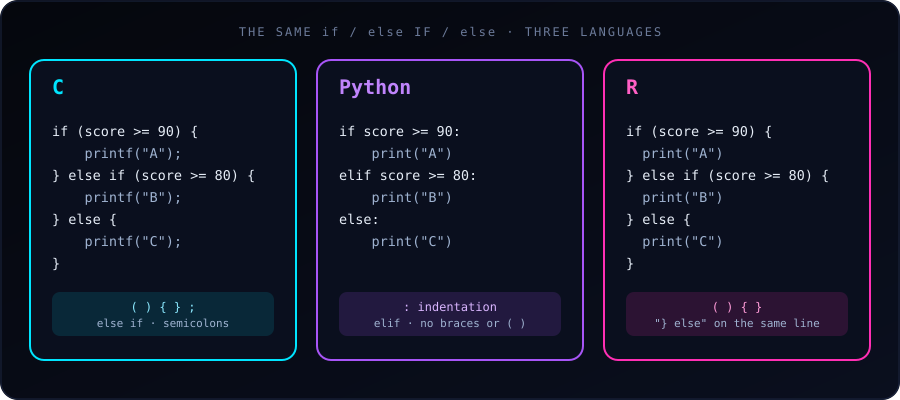

{fig-alt="Three cards compare the same if, else if, else grade check in C, Python and R. C and R use parentheses and braces; Python uses colons, indentation and elif."}

The logic of an `if-else` statement is identical in C, Python and R: test a condition, run one block if it is true, otherwise run another. What differs is the **syntax**: how blocks are marked (braces vs. indentation) and how "else if" is written.

The same program in each language (grade from a score of 85):

::: {.panel-tabset}

## C

C uses parentheses `()` around the condition and curly braces `{}` for blocks. Multiple conditions use `else if`, and every statement ends with `;`.

```c
#include <stdio.h>

int main() {
    int score = 85;

    if (score >= 90) {
        printf("Grade: A\n");
    } else if (score >= 80) {
        printf("Grade: B\n");
    } else {
        printf("Grade: C\n");
    }

    return 0;
}
```

## Python

Python drops the braces and the parentheses. A colon `:` and **indentation** define the blocks, and "else if" is contracted to a single keyword, `elif`.

```python
score = 85

if score >= 90:
    print("Grade: A")
elif score >= 80:
    print("Grade: B")
else:
    print("Grade: C")
```

## R

R looks much like C: parentheses, braces, `else if`. But it has a formatting quirk: at the top level, `else` must sit on the **same line** as the closing brace `}` of the previous block.

```r
score <- 85

if (score >= 90) {
  print("Grade: A")
} else if (score >= 80) {
  print("Grade: B")
} else {
  print("Grade: C")
}
```

:::

All three print `Grade: B`.

## Direct syntax comparison

| Feature | C | Python | R |
|---|---|---|---|
| Condition wrapper | Requires `( )` | No wrapper | Requires `( )` |
| Block boundary | `{ }` | `:` + indentation | `{ }` |
| "Else if" keyword | `else if` | `elif` | `else if` |
| Statement end | `;` | Line break | Line break |
| Boolean operators | `&&`, `\|\|`, `!` | `and`, `or`, `not` | `&&`, `\|\|`, `!` |
| True / false | `1` / `0` (or `true` / `false` with `<stdbool.h>`) | `True` / `False` | `TRUE` / `FALSE` |
| Equality test | `==` | `==` | `==` |

## Gotchas in each language

::: {.callout-warning}
## R: `else` on a new line fails at top level
This works inside a function or a `{ }` block, but at the console or top level of a script it is a syntax error, because R finishes the `if` statement at the end of the line:

```r
if (score >= 90) {
  print("Grade: A")
}
else {              # Error: unexpected 'else'
  print("Grade: B")
}
```

Keep `} else {` on one line and you never hit this.
:::

- **C: `=` instead of `==`.** `if (score = 90)` assigns 90 and is always true. Compile with `-Wall` and the compiler warns you. Python and R reject an assignment in the condition in most forms.
- **C: no braces means one statement.** Braces are optional for a single statement, but adding a second line without them is a classic bug. Always use braces.
- **Python: inconsistent indentation.** Mixing tabs and spaces raises an `IndentationError`. Use 4 spaces everywhere.
- **R: the condition must be a single `TRUE` or `FALSE`.** In R 4.2 and later, `if (c(TRUE, FALSE))` is an error. For whole vectors, use `ifelse()` (below).

## What counts as "true"?

- **C:** any non-zero value is true; `0` is false. `if (5)` runs.
- **Python:** `0`, `0.0`, `""`, `[]`, `{}` and `None` are false; almost everything else is true.
- **R:** only logical values (or numbers, where `0` is false and non-zero is true) are accepted, and `NA` in a condition is an error: `if (NA)` stops with "missing value where TRUE/FALSE needed".

## One-line versions (conditional expressions)

Each language has a compact form that picks a value:

```c
// C: ternary operator
const char *result = (score >= 50) ? "Pass" : "Fail";
```

```python
# Python: conditional expression
result = "Pass" if score >= 50 else "Fail"
```

```r
# R: if-else is itself an expression
result <- if (score >= 50) "Pass" else "Fail"
```

## R bonus: vectorized `ifelse()`

Base `if` works on one value. To apply a condition to every element of a vector, use `ifelse()`:

```r
scores <- c(95, 85, 72, 40)
ifelse(scores >= 50, "Pass", "Fail")
#> [1] "Pass" "Pass" "Pass" "Fail"
```

The Python equivalent for arrays is `numpy.where(scores >= 50, "Pass", "Fail")`.

## Which should you use?

There is no "better" version, only different conventions. If you know one, the others are quick to learn: the concept transfers, and only the punctuation changes. Pay most attention to Python's indentation and R's `} else` rule, since those are the two places where a small formatting slip changes the meaning or breaks the program.

See also: [10 Real-World `if / else` Examples in C](10-c-if-else-examples.html).
