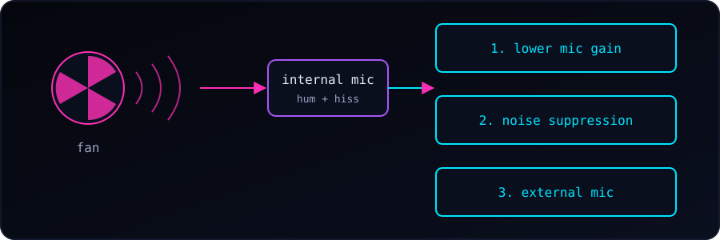

{fig-alt="A fan emits noise waves into the internal microphone. Three fixes are listed: lower mic gain, noise suppression, and an external mic."}

On Linux laptops, the internal microphone often picks up the sound of the cooling fan. The mic sits close to the heat pipes and fan assembly, or the input gain is set too high. Users on Reddit report the same thing: built-in laptop mics commonly capture loud fan noise and internal speaker bleed.

### 1. Lower the microphone gain

High input gain overdrives the microphone and amplifies background whirring. Let's lower the internal microphone volume using `alsamixer`, `pavucontrol`, or the sound panel of our desktop environment (GNOME, KDE).

```bash
alsamixer      # press F4 for capture devices, adjust with the arrow keys
```

Lower it only until the fan fades but our voice is still clear. Going too far (we tried 30% and below) makes the recording very quiet. The ALSA `Capture` slider and the desktop's input volume can both change the level, so check both. We can also set it from the terminal:

```bash
wpctl set-volume @DEFAULT_AUDIO_SOURCE@ 0.8    # 0.0 to 1.0
```

If the recording is too quiet afterwards, we raise the level again and rely on noise suppression (next step) instead of low gain.

### 2. Enable noise suppression in PipeWire / PulseAudio

Modern distributions using PipeWire or PulseAudio support echo cancellation and noise suppression. We can enable a noise-reduction filter, or use tools such as NoiseTorch or a PipeWire noise-canceling source, to filter out the steady hum of a fan.

### 3. Stop the fan from running constantly

Overlapping power tools (for example TLP, `power-profiles-daemon` and `cpupower`) can lock the CPU in high-frequency states and keep the fan spinning. We should make sure only one power-profile daemon is active, set to a balanced or power-saving mode.

### 4. Clean the vents and check the thermal paste

If the fan runs at full speed all the time, we clear dust from the intake and exhaust vents with compressed air. On older machines, dried-out thermal paste can also force the fan to spin fast even under light load.

### 5. Use an external microphone

If the internal mic capsule sits too close to the fan duct, software fixes may not be enough. Switching to a USB or headset microphone and disabling the internal one is the most reliable workaround.

### References

- [Reddit: laptop internal microphone picks up loud fan](https://www.reddit.com/r/linuxquestions/comments/1sx4fgk/laptop_internal_microphone_picks_up_loud_fan_and/)
- [Framework Community: terrible noise on the internal microphone](https://community.frame.work/t/terrible-noise-on-the-internal-microphone/12259)
- [Arch Linux forum thread](https://bbs.archlinux.org/viewtopic.php?id=293880)
- [Ask Ubuntu: internal mic only capturing static noise](https://askubuntu.com/questions/961200/internal-mic-only-capturing-static-noise-in-asus-laptop-ubuntu-16-04)
- [MakeUseOf: fixing constant Linux laptop fan noise](https://www.makeuseof.com/finally-fixed-linux-laptops-constant-fan-noise-it-wasnt-hardware/)
- [System76: fan noise](https://system76.com/support/fan-noise/)
