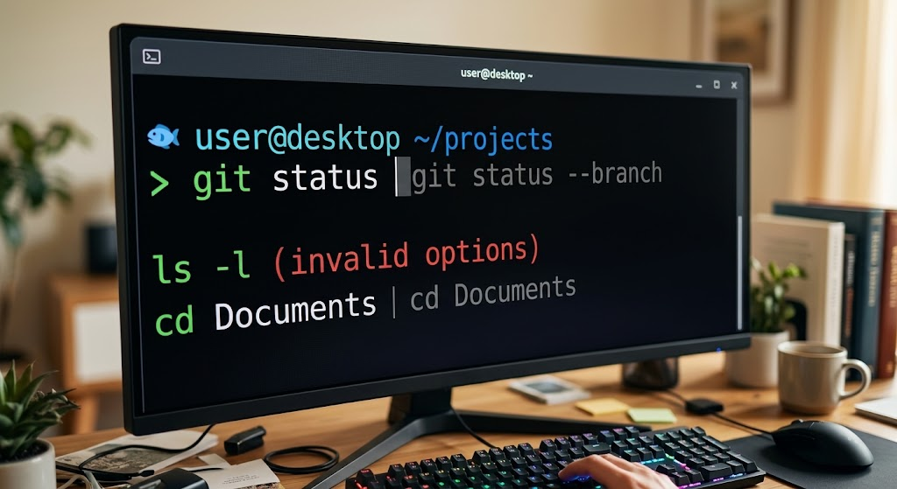

By default, most Linux distributions come with Bash or Zsh. [Fish](https://fishshell.com/) (the **F**riendly **I**nteractive **SH**ell) is a popular alternative with sane defaults, autosuggestions, and syntax highlighting out of the box. Because different distributions handle terminal environments and user profiles differently, there are two ways to switch: the **System-Wide Method** (works for most distros like Ubuntu, Fedora, Arch) and the **Terminal Profile Override** (required for Pop!_OS and some GNOME-based setups).



## Step 1: Install Fish

Before changing your default shell, ensure Fish is installed for your distribution.

* Ubuntu / Debian / Pop!_OS:

```bash
sudo apt update && sudo apt install fish -y
```

* Fedora / RHEL:

```bash
sudo dnf install fish -y
```

* Arch Linux / Manjaro:

```bash
sudo pacman -S fish --noconfirm
```

See the official [Fish installation docs](https://fishshell.com/docs/current/index.html#installation) for other package managers and platforms.

## Method 1: The Standard System-Wide Method

Best for: Ubuntu, Fedora, Arch Linux, Debian, openSUSE, and SSH/remote servers.

This method uses [`chsh`](https://man7.org/linux/man-pages/man1/chsh.1.html) to tell the operating system itself to assign Fish to your user account across all environments, including virtual consoles and SSH.

### 1. Find Fish's path and change your shell

If you are currently running Bash or Zsh, use this command:

```bash
chsh -s $(which fish)
```

If you are already inside a temporary Fish session, the syntax changes slightly, because Fish uses plain parentheses `()` for command substitution instead of `$()`:

```bash
chsh -s (which fish)
```

You will be prompted to enter your account password.

### 2. Apply the changes

The operating system caches your shell configuration when you log in. To apply the change, log out of your desktop environment (or reboot), then log back in.

## Method 2: The Terminal Profile Override

Required for: Pop!_OS, or any distro using [GNOME Terminal](https://help.gnome.org/users/gnome-terminal/stable/) where Method 1 fails.

Distributions like Pop!_OS use a heavily customized GNOME Terminal setup that often forces Bash to load, overriding the system-level `chsh` command. The fix is to force the terminal app itself to launch Fish.

### Step-by-step instructions

1. Open your terminal application.
2. Click the menu icon (three horizontal lines) in the top-right corner.
3. Select **Preferences**.
4. In the left sidebar under **Profiles**, click your active profile (usually named "Unnamed" or "Default").
5. Open the **Command** tab.
6. Check the box for **"Run a custom command instead of my shell"**.
7. In the **Custom command** box, type exactly: `fish`
8. Close the Preferences window.
9. Completely close all terminal windows and open a new one.

## Step 3: Verify Your Shell

To confirm you're running inside the Fish environment, open a new terminal window and run:

```bash
echo $0
```

* If it outputs `fish`, the change was successful.
* If it still outputs `bash`, double-check that your terminal application's profile settings are properly saved (Method 2).
