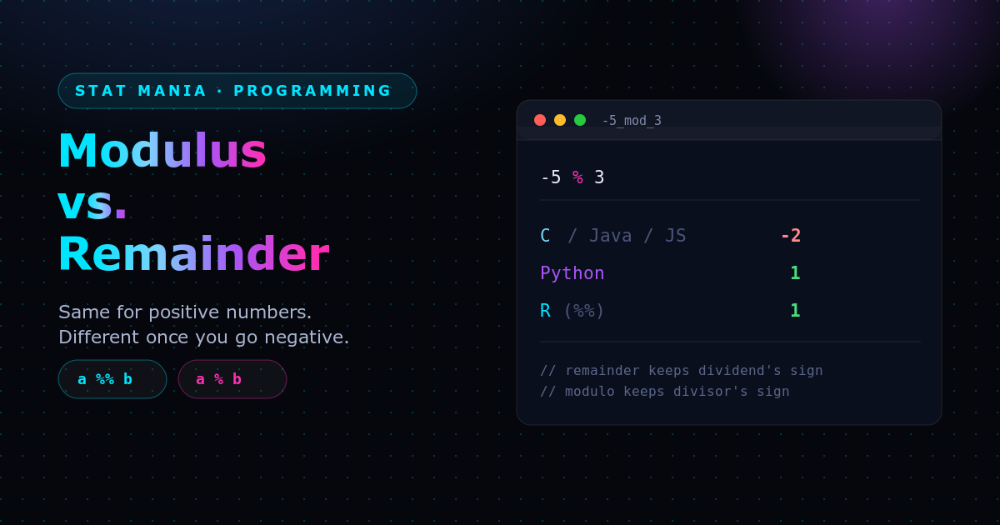

No, modulus and remainder are not always the same — though they give the exact same answer for positive numbers. The difference shows up once negative numbers are involved, and it depends entirely on how the programming language (or math formula) handles negative division.

### Key Differences

**For positive numbers**, both operations do the same thing: divide two numbers and return what's left over. `5 % 2` is `1` either way.

**For negative numbers**, they use different rules to decide the sign of the result:

- **Remainder** keeps the sign of the *dividend* (the first number). C, C++, Java, and JavaScript all treat `%` as a remainder operator — `-21 % 4` is `-1`.
- **Modulus** (modulo) keeps the sign of the *divisor* (the second number). Python treats `%` as a true modulo — `-21 % 4` is `3`.

### Why They Differ

- **Remainder** comes from **truncated division**: the quotient is rounded *toward zero*, so the leftover value keeps the sign of the number being divided.
- **Modulo** comes from **floored division**: the quotient is rounded *down, toward negative infinity*, so the leftover value always matches the sign of the divisor.

### Worked Example: -5 ÷ 3

$-5 \div 3 \approx -1.66\overline{6}$

**Remainder (truncate toward zero):** the quotient rounds to $-1$.
$$\text{leftover} = -5 - (3 \times -1) = \mathbf{-2}$$

**Modulo (floor toward $-\infty$):** the quotient rounds to $-2$.
$$\text{leftover} = -5 - (3 \times -2) = \mathbf{1}$$

Same inputs, different rounding rule for the quotient, different sign on the result.

### C vs. Python, Side by Side

| | C (and C++, Java, JavaScript) | Python |
|---|---|---|
| Operation | Remainder | Modulus |
| Rule | Result takes the sign of the **dividend** | Result takes the sign of the **divisor** |
| Expression | `-5 % 3` | `-5 % 3` |
| Result | `-2` | `1` |

### The "Clock" Intuition for Modulo

Think of modulo as a circular clock. If the divisor is `3`, the only possible results are `0`, `1`, and `2` — it always wraps around cleanly to a value with the divisor's sign. Starting at `0` and stepping backward 5 times on a 3-hour clock lands you on `1`, which is exactly what `-5 % 3` gives in Python.

### Where R Fits In

R behaves exactly like Python: it computes a true mathematical modulus (floored division), not a truncated remainder. In R, the modulus operator is written `%%` — it rounds the division downward toward negative infinity, so the result always takes the sign of the divisor.

```r
-5 %% 3
# [1] 1

5 %% -3
# [1] -1
```

R also provides a matching integer-division operator, `%/%`, which finds the quotient rounded down toward negative infinity:

```r
-5 %/% 3
# [1] -2
```

That quotient is exactly what makes the modulus formula work: `-5 - (3 * -2) = 1`.

### Summary Checklist

- **Positive numbers?** Remainder and modulus always agree — `5 % 3` is `2` in both C and Python.
- **Negative numbers?** They can disagree:
  - C, C++, Java, JavaScript: result takes the sign of the **dividend** (remainder).
  - Python, R: result takes the sign of the **divisor** (modulus).
- **The reason:** remainder truncates the quotient toward zero; modulus floors it toward negative infinity.

### Further Reading

- [Stack Overflow: What's the difference between "mod" and "remainder"?](https://stackoverflow.com/questions/13683563/whats-the-difference-between-mod-and-remainder)
- [Wikipedia: Modulo](https://en.wikipedia.org/wiki/Modulo)
- [bigmachine.io: Mod and remainder are not the same](https://bigmachine.io/articles/theory/mod-and-remainder-are-not-the-same)
