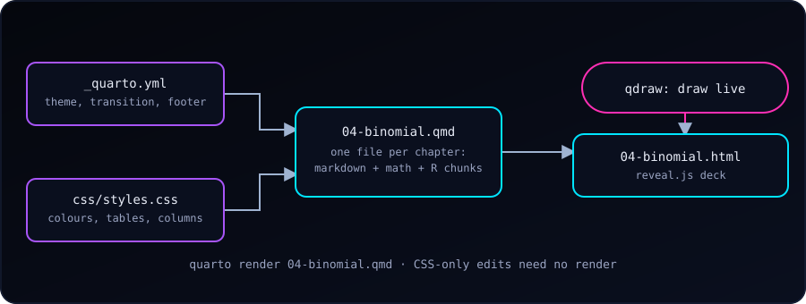
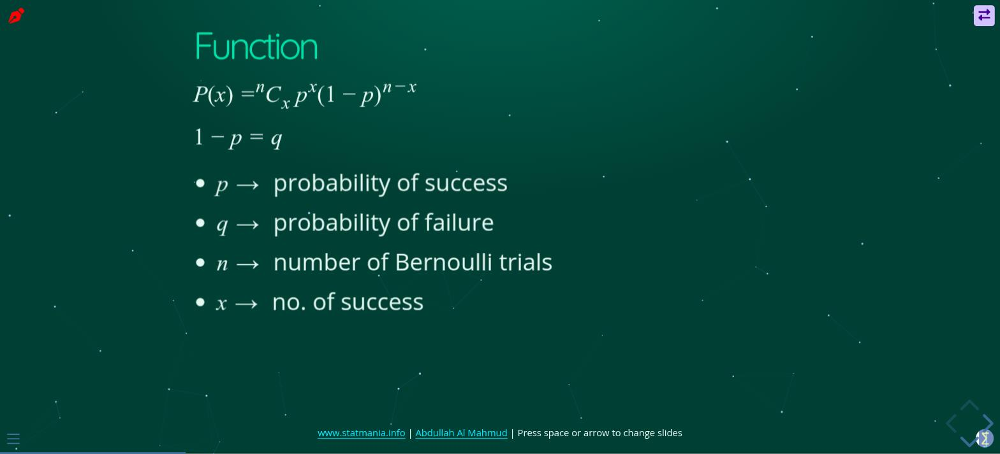

{fig-alt="A _quarto.yml and a css/styles.css feed a chapter .qmd file, which renders to a reveal.js HTML deck, with the qdraw plugin adding live drawing on top."}

Statistics slides need three things at once: readable text, real math, and numbers that are actually correct. After trying the usual slide tools, I settled on **Quarto with reveal.js**. Each chapter is one plain-text file; math is LaTeX, tables and plots come from R code, and the result is a web page that opens anywhere. This post shows the setup behind the [Stat Mania lecture slides](https://www.statmania.info/lectures.html), so we can build the same thing.

{fig-alt="A teal lecture slide titled Function showing the binomial formula P(x) = nCx p^x (1-p)^(n-x), and bullets defining p, q, n and x."}

### Why Quarto + reveal.js

- **Plain text.** A deck is a `.qmd` file, so it works with git, diffs and any editor.
- **Math just works.** `$\binom{n}{x}p^x(1-p)^{n-x}$` renders crisply at any size.
- **Code lives next to the slide.** An R chunk computes the table, so the numbers cannot drift from the explanation.
- **It is a web page.** Students open a link on a phone; nothing to install.
- **One look for every deck**, from a single config and stylesheet.

### The Layout: One Config, Many Decks

All the lecture files sit in one folder that is a small Quarto project:

```
slide/
  _quarto.yml               # shared settings for every deck
  css/styles.css            # the theme
  js/starfield-bg.js        # optional animated background
  01-stat-intro.qmd
  04-binomial.qmd
  06-correlation-regression.qmd
  …
```

The shared `_quarto.yml` holds everything a deck should have in common, so each chapter file stays short:

```yaml
project:
  type: website
  output-dir: .          # the .html lands next to its .qmd

format:
  revealjs:
    theme: sky
    transition: convex
    slide-number: c/t        # "current / total"
    navigation-mode: vertical
    incremental: true        # bullets appear one at a time
    highlight-style: dracula
    css: css/styles.css
    footer: '<a href="https://www.statmania.info">statmania.info</a> | Press space or arrow to change slides'

revealjs-plugins:
  - qdraw                    # draw on slides while teaching
```

`incremental: true` is the setting I like most for lectures: every bullet list reveals one point per key press, so students do not read ahead of the explanation.

A chapter file then needs only a few lines of front matter:

```yaml
---
title: "Binomial Distribution"
author: Your Name
format: revealjs
---
```

### Writing Slides

The structure is just headings: `#` starts a **section** (a title slide) and `##` starts a **slide**.

````markdown
# Concept

- Success or failure
- Detecting a disease is a success

## Function

$P(x) = \binom{n}{x} p^x (1-p)^{n-x}$

- $p$: probability of success
- $n$: number of trials
````

A few patterns cover most of what a statistics lecture needs.

**Pause for a question.** `. . .` (three spaced dots) hides everything below until the next key press. It is perfect for "what is the answer?" slides:

````markdown
## Answer on click

What is P(X = 2) for n = 5, p = 0.3?

. . .

```{r}
dbinom(2, 5, 0.3)
```
````

**Compute, do not copy.** Mark a chunk `echo: false` to show only its output. The table on the slide is then produced by the same code that would give the answer in an exam:

````markdown
```{r}
#| echo: false
x <- 0:5
round(dbinom(x, 5, 0.3), 3)
```
````

**Two columns:** text beside a table or plot.

````markdown
::: {.columns}
::: {.column width="45%"}
(left: a table or plot)
:::
::: {.column width="55%"}
- n = 5, p = 0.3
- What do we see?
:::
:::
````

**Tabs** for R versus Python (or "formula versus code") on a single slide:

````markdown
::: {.panel-tabset}
### R
```r
dbinom(2, 5, 0.3)
```
### Python
```python
from scipy.stats import binom
binom.pmf(2, 5, 0.3)
```
:::
````

**Small utilities.** `## Title {.smaller}` shrinks the text on a crowded slide. `## Title {background-color="white"}` gives a slide a white background, useful for a plot or an image with its own white page. `## Title {visibility="hidden"}` keeps a draft slide in the file but leaves it out of the rendered deck, so it never reaches the audience.

### A Theme That Works for Teaching

reveal.js ships with themes (I start from `sky`), then `css/styles.css` restyles everything with a handful of CSS variables:

```css
:root{
  --sm-bg: #0b3d34;      /* deep teal */
  --sm-cyan: #00e5ff;
  --sm-green: #2dd4a7;
  --sm-text: #e6f7f2;
}
```

One decision came from live teaching. The background is a deep **teal rather than near-black**. The qdraw pen (below) draws in black by default, and on a black background the ink was invisible. A dark-but-not-black background keeps the mood and keeps the pen readable. A small script (`starfield-bg.js`, added with `include-after-body:`) draws a calm animated starfield behind the slides; it is optional.

The stylesheet is a *linked* file, not baked into each deck. So when I only change colours, spacing or table styles, **I do not need to re-render any slides**; a browser refresh shows the change on all decks.

### Drawing on Slides

Circling a term, sketching a normal curve or underlining a step is much of teaching. [qdraw](https://www.thinkermahmud.com/qdraw/) is a small Quarto extension that adds a pen, shapes and an eraser on top of any reveal.js slide. It is one line in `_quarto.yml` (`revealjs-plugins: [qdraw]`) after installing it with `quarto add`. I wrote about its newer features in [What's New in qdraw](qdraw-new-features.qmd).

### Render, Check, Publish

Rendering one deck is one command from the slides folder:

```
quarto render 04-binomial.qmd
```

Because `output-dir: .`, the HTML appears next to the source, ready to commit. Publishing is then the usual: add the files, commit, push, and the static host serves them. While presenting, the built-in keys help: `space` or the arrow keys to move, `o` for an overview of all slides, `f` for full screen, and `?` for the list of shortcuts. To hand out a PDF, open the deck with `?print-pdf` added to the address and use the browser's *Print to PDF*.

### Habits That Save Time

- **One chapter, one file.** Short files render in seconds and are easy to reorder.
- **Keep shared choices in `_quarto.yml` and the CSS**, never repeated in decks.
- **Use sections** (`#`) so students can navigate a long chapter by topic.
- **Let code produce the numbers.** If an example changes, the slide updates itself.
- **Hide drafts** with `visibility="hidden"` instead of commenting them out.

### Start Your Own

1. Install Quarto and create a folder with a `_quarto.yml` like the one above.
2. Add `01-intro.qmd` with `format: revealjs` and a few `##` slides.
3. Run `quarto render 01-intro.qmd` and open the HTML.
4. Move repeated settings into `_quarto.yml` and `css/styles.css` as the second deck shows you what to share.

Slides stay small and boring in the best way: Markdown for words, LaTeX for math, R for numbers, and one stylesheet for the look.
