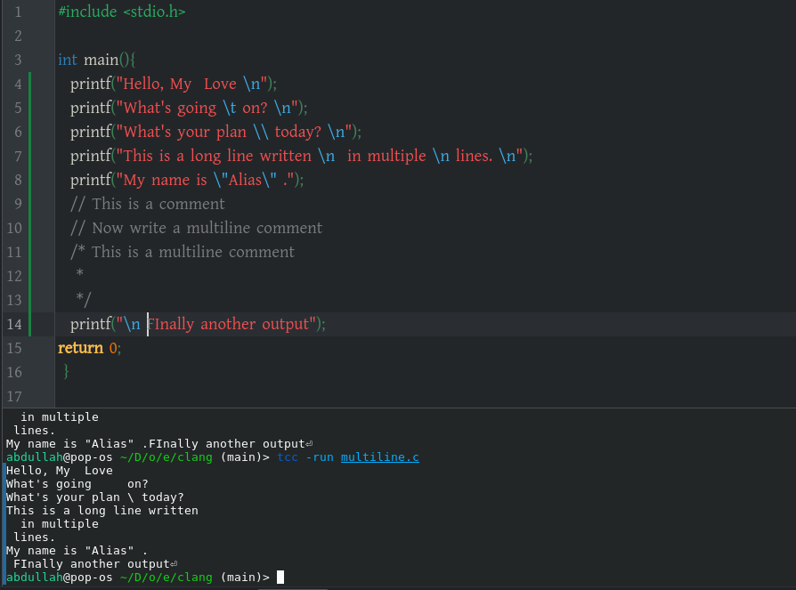

If you're learning C on Linux, typing out `gcc program.c -o program && ./program` for every tiny change gets tedious fast — and the bare compiler command hides bugs that would otherwise show up as warnings. Here's a practical workflow: faster ways to compile and run, the flags you should always turn on, tools that get you closer to a REPL, how to debug crashes and memory errors, and a routine for practicing deliberately.

### 1. The Fastest Way to Practice: One-Liners and Aliases

Typing `gcc program.c -o program && ./program` every time gets old fast. Here are three ways to speed it up.

**Option A: The One-Liner with `&&`**

The `&&` means "only run the next command if the previous one succeeded." This prevents you from running a stale old binary if your code has compile errors.

```bash
gcc program.c -o program && ./program
```

**Option B: Bash Aliases (Highly Recommended)**

Open your shell config file:
```bash
nano ~/.bashrc
```

Add these lines at the bottom:
```bash
# Compile and run C
alias crun='gcc -Wall -Wextra -g -o /tmp/a.out && /tmp/a.out'
alias cwarn='gcc -Wall -Wextra -Wpedantic -g -o /tmp/a.out'
```

Save, then reload:
```bash
source ~/.bashrc
```

Now, from any directory, you can just type:
```bash
crun program.c
```

This compiles `program.c` with all warnings enabled, outputs to `/tmp/a.out`, and runs it immediately if compilation succeeds. `cwarn` is useful when you want to compile but not run yet.

**Option C: A Simple `Makefile`**

For anything beyond a single file, create a file named `Makefile` in your working directory:

```makefile
CC = gcc
CFLAGS = -Wall -Wextra -g -std=c11
TARGET = program
SRC = program.c

all: $(TARGET)

$(TARGET): $(SRC)
	$(CC) $(CFLAGS) -o $(TARGET) $(SRC)

run: $(TARGET)
	./$(TARGET)

clean:
	rm -f $(TARGET)
```

Then you just type:
```bash
make run
```

And to clean up:
```bash
make clean
```

This is the professional standard and scales to multiple files later.

---

### 2. The Flags You Should Always Use

The bare-minimum command `gcc program_name.c -o my_program` works, but it hides problems. Always add these flags:

```bash
gcc -Wall -Wextra -Wpedantic -g -std=c11 program.c -o program
```

| Flag | What it does |
| :--- | :--- |
| `-Wall` | Enables most common warnings (uninitialized variables, unused variables, etc.) |
| `-Wextra` | Enables additional warnings beyond `-Wall` |
| `-Wpedantic` | Warns about non-standard C extensions |
| `-g` | Includes debug symbols (essential for `gdb`) |
| `-std=c11` | Uses the C11 standard (or use `-std=c17`, `-std=c99`) |
| `-O2` | Optimization level 2 (for release builds; **don't use while debugging**) |

**Why warnings matter:** In C, many bugs are not errors—they compile fine but crash at runtime or behave incorrectly. Warnings catch these before you run. **Treat every warning as an error you must fix.**

To make warnings fatal (force yourself to fix them):
```bash
gcc -Wall -Wextra -Werror -g program.c -o program
```

With `-Werror`, the compiler refuses to produce an executable if there are any warnings.

---

### 3. Faster Testing: The REPL-like Workflow

C doesn't have a REPL like Python or R, but you can approximate one with these tools:

**Tool 1: `tcc` (Tiny C Compiler)**

`tcc` compiles and runs C almost instantly. Install it:
```bash
sudo apt install tcc    # Debian/Ubuntu
sudo dnf install tcc    # Fedora
```

Then:
```bash
tcc -run program.c
```

This compiles and runs in one step with no output file. It's the closest thing to a C REPL for quick experiments. It's not as strict as `gcc`, but great for testing small snippets.

**Tool 2: `cling` (C++ Interpreter, works for C)**

`cling` is an interactive C++ interpreter built on LLVM. It can run C code interactively:
```bash
sudo apt install cling   # May need to add a PPA or download from GitHub
cling
```

Then type C statements directly:
```c
printf("Hello\n");
int x = 5;
x * 2
```

This is genuinely REPL-like and excellent for experimenting with expressions.

**Tool 3: Online Compilers (for zero-setup experiments)**

*   **Compiler Explorer (godbolt.org):** Shows the assembly output side-by-side with your C code. Incredible for understanding what the compiler does.
*   **OnlineGDB (onlinegdb.com):** Full IDE with debugger in the browser.
*   **Replit (replit.com):** Collaborative, instant C environment.

Use these when you want to test a quick idea without touching your terminal.

---

### 4. Debugging: `gdb` and `valgrind`

**`gdb` (GNU Debugger)**

Compile with `-g`, then:
```bash
gdb ./program
```

Inside gdb:
```
(gdb) break main        # Set a breakpoint at main
(gdb) run               # Start the program
(gdb) next              # Execute next line
(gdb) print x           # Print value of variable x
(gdb) continue          # Continue execution
(gdb) quit              # Exit
```

This lets you step through your code line by line, inspect variables, and see exactly where a crash happens. Essential for finding segmentation faults.

**`valgrind` (Memory Error Detector)**

This is critical once you start using `malloc` and `free`:
```bash
valgrind --leak-check=full ./program
```

It will tell you:
*   If you leaked memory (allocated but never freed)
*   If you accessed memory you shouldn't have
*   If you used uninitialized memory

Install it:
```bash
sudo apt install valgrind
```

Run this on every program you write that uses dynamic memory. It will save you hours of confusion.

---

### 5. A Suggested Practice Routine

**Week 1–2: Fundamentals**
Write 5–10 small programs per day covering:
*   Variables, types, `printf`/`scanf`
*   `if/else`, `switch`
*   `for`, `while`, `do-while`
*   Functions and recursion

**Week 3–4: Arrays and Strings**
*   Reverse an array
*   Find the max/min
*   Implement `strlen`, `strcpy`, `strcmp` yourself
*   Bubble sort, selection sort, insertion sort on arrays

**Week 5–6: Pointers**
*   Swap two variables using pointers
*   Pass arrays to functions
*   Pointer arithmetic
*   Dynamic arrays with `malloc`/`free`

**Week 7–8: Structs and Files**
*   Define a `struct` for a student record
*   Read/write structs to a binary file
*   Build a simple linked list

**Daily habit:**
1. Write the program in a text editor (use `nano`, `vim`, or VS Code).
2. Compile with all warnings: `gcc -Wall -Wextra -Wpedantic -g -std=c11 file.c -o file`
3. Fix every warning.
4. Run it.
5. If it crashes, use `gdb`.
6. If it uses `malloc`, run `valgrind`.

---

### 6. Recommended Editors/IDEs on Linux

*   **VS Code** with the C/C++ extension: Best balance of features and simplicity. Has integrated debugging.
*   **Neovim/Vim** with `coc.nvim` or `clangd`: For terminal purists.
*   **CLion**: Full-featured IDE (free for students with a JetBrains account).
*   **Code::Blocks**: Lightweight IDE, good for beginners.

---

### Quick Reference Card

```bash
# Compile with all warnings
gcc -Wall -Wextra -Wpedantic -g -std=c11 program.c -o program

# Compile and run (only if compile succeeds)
gcc -Wall -Wextra -g program.c -o program && ./program

# Run with memory checking (for programs using malloc)
valgrind --leak-check=full ./program

# Debug
gdb ./program

# Quick test with tcc
tcc -run program.c

# Using make
make run
make clean
```

Pin an alias, turn on `-Wall -Wextra`, and reach for `gdb`/`valgrind` the moment something misbehaves — that's most of the workflow. The rest comes from writing a lot of small programs, which is exactly what the practice routine above is for.

### 7. My Personal Choice

I installed tcc, and now I write code in the Kate editor and run it in the terminal at the bottom.

```bash
tcc -run program.c
```


