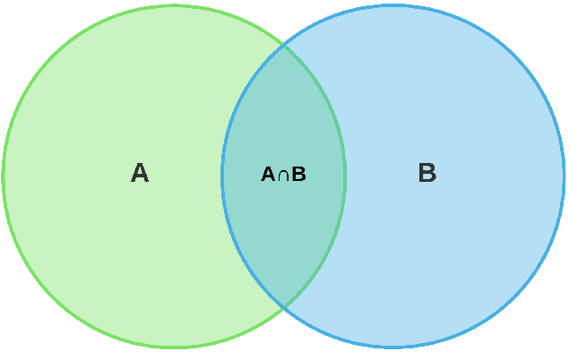

# Terms

<div class="container">
<div class="col">
> - Experiment: An act repeated under given condition
> - Trial
> - Sample space
> - Sample point
> - Event
</div>
<div class="col">
> - Mutually Exclusive/
> - Equally likely
> - Certain event
> - Impossible event
</div>
</div>


## Measures of Probability

::: {.panel-tabset}

### Classical

- Classical/Priori $\rightarrow P(A) = \frac{n(A)}{n(S)}$
- A number is chosen from 1 to 10; P(2)=?

### Empirical

- Empirical $\displaystyle \lim_{n(S) \to \infty} \frac{n(A)}{n(S)}$
- P(H) if a coin is tossed 100 times, 1000 times, ...

:::


## Additive Laws {.smaller}

<div class="container">
<div class="col">
> - Mutually Exclusive events
> - $\rightarrow P(A \cup B) = P(A) + P(B)$
> - Non-Mutually Exclusive events
> - $\rightarrow P(A \cup B) = P(A) + P(B) - P(A \cap B)$
</div>
<div class="col">

</div>
</div>

## Additive Law Example

$1, 2, 3, \cdots 10$

> - P(Even)
> - P(Even or Multiple of 2)
> - $P(EUM) = P(E) + P(M)$
> - $P(2 or 7)$

# Coin-Die

Create the sample space of

> - A coin tossed twice
> - A coin tossed thrice/ three coins toseed together
> - A coin and and a die are thrown together
> - Two dice are thrown together

## Probability Tree

```{mermaid}
graph LR
    Start((Start  )) --> H1[H ]
    Start --> T1[T ]

    H1 --> HH[HH  ]
    H1 --> HT[HT  ]
    T1 --> TH[TH  ]
    T1 --> TT[TT  ]

    HH --> HHH[HHH    ]
    HH --> HHT[HHT    ]
    HT --> HTH[HTH    ]
    HT --> HTT[HTT    ]
    TH --> THH[THH    ]
    TH --> THT[THT    ]
    TT --> TTH[TTH    ]
    TT --> TTT[TTT    ]
```

::: footer

:::

## Coin without Sample Space

A coin is tossed 10 times.

i. P(4H)
ii. P(no less than 3T)
iii. P(At most 2H)
iv. P(At least 3H)

# Conditional Probability

If $B$ occurs, what is the probability that A occurs?

$P(A|B) = \frac{P(A \cap B)}{P(B)}$

## Conditional Probability Example

$P(A)$

## Multiplicative Laws

> - If A & B are independent, $P(A \cap B) = P(A) \times P(B)$
> - Otherwise $\uparrow$
> - $P(A \cap B) = P(B) \times P(A|B)$

## Check dependency

S = {1,2,3,4,5,6}

> - Case -1. A = {1,3,5}, B = {2,4,6}
> - Case -2. A = {1,3,5}, B={1,3,4,6}

## Spam mail vs Ham

$C =$ The word Cogratulastions is present

|   C   | Spam | Ham | Total |
|:-----:|:----:|:---:|:-----:|
|  Yes  |  20  |  1  |   21  |
|   No  |  10  |  39 |   49  |
| Total |  30  |  40 |   70  |

## Conditional - Three Bags with Coins and Taka

Bag 1 contains 1 note and 3 coins, Bag 2 has 2 notes and 4 coins, while Bag 3 has 3 notes and 1 coin. A bag is randomly selected and one item is selected; what is the probability that the selected item is a note?

> - $P(B_1) = P(B_2) = P(B_3)$
> - Let $N = Note$
> - $P(N \cap B_1) + P(N \cap B_2) + P(N \cap B_3)$
> - $P(N|B_1) \times P(N) + ...$

## Conditional - Two bags

A bag I contains 4 white and 6 black balls while another Bag II contains 4 white and 3 black balls. One ball is drawn at random from one of the bags, and it is found to be black. Find the probability that it was drawn from Bag I.

## Expansion of P(A ∩ B̅) {.smaller}


<div class="container">
<div class="col">

$P(A \cap \bar B) = P(A) - P(A ∩ B)$

WHY?

And What does it mean?

> - Only A
</div>
<div class="col">

</div>
</div>

## Expansion of A {.smaller}

<div class="container">
<div class="col">
> - $P(A|B) = \frac{P(A \cap B)}{P(B)}$
> - $P(A) = P(A \cap B) + P(A \cap \bar B)$
> - Expand more
> - $P(A) = P(A|B) \times P(B) + P(A|\bar B) \times P(\bar B)$
</div>
<div class="col">

</div>
</div>

## Conditional: Promotion

A company finds that for a randomly selected employee, 30% completed a certification, 20% received a promotion, and 15% both completed the certification and received a promotion.

> - The probability of promotion if certified.
> - The probability of certification if promoted.
> - Are certification and promotion independent events?

## Conditional: Job Completion

A person has undertaken a job. The probability of completing the job on time if it rains is 0.44, and the probability of completing the job on time if it does not rain is 0.95. If the probability that it will rain is 0.45, then determine the probability that the job will be completed on time.

## Conditional: 3 Urns

There are three urns containing 3 white and 2 black balls, 2 white and 3 black balls, and 1 black and 4 white balls, respectively. There is an equal probability of each urn being chosen. One ball is equal probability chosen at random. What is the probability that a white ball will be drawn?

## Conditional vs Intersection {.smaller}

|                         Phrase                        | Interpret as | Notation     |
|:-----------------------------------------------------:|:------------:|--------------|
|       "400 infected individuals tested positive"      | Intersection | $P(I\cap T)$ |
| "400 **of the** infected individuals tested positive" |  Conditional | $P(T|I)$    |
|       "400 out of 500 infected tested positive"       |  Conditional |              |
|          "The test caught 400 infected cases"         | Intersection |              |
|         "Among infected, 400 tested positive"         |  Conditional |              |

# Base Rate Fallacy

Refer to [this page](https://en.wikipedia.org/wiki/Base_rate_fallacy)

## Vaccinated people more hospitalized? {.smaller}

::: {.panel-tabset}

### Vaccination Status

| Vaccination Status | Hospitalized with COVID-19 |
|:------------------:|:--------------------------:|
|     Vaccinated     |             180            |
|    Unvaccinated    |             50             |
|      **Total**     |             230            |

### True Picture

| Vaccination Status | Hospitalized | Unhospitalized | Total Population | Hospitalization Rate |
|:------------------:|:------------:|:--------------:|:----------------:|:--------------------:|
|     Vaccinated     |      180     |      8,820     |       9,000      |         2.0%         |
|    Unvaccinated    |      50      |       950      |       1,000      |         5.0%         |
|      **Total**     |    **230**   |    **9,770**   |    **10,000**    |                      |

:::


## Low-prevalence population {.smaller}

| Diagnosis        |      Infected      |      Uninfected     | Total |
|:----------------:|:------------------:|:-------------------:|:-----:|
|   Test positive  | 20 (true positive) | 49 (false positive) |   69  |
|   Test negative  | 0 (false negative) | 931 (true negative) |  931  |
|       Total      |         20         |         980         |  1000 |

Accuracy = $\frac{20+931}{1000} = 0.951 \approx 95\%$

But


> - $P(\text{Actually Infected if Tested Positive})=?$
> - $P(I|P) = \frac{20}{69} = 29.98\%$
> - Because the rate of infection is low


## High-prevalence population {.smaller}

|   Diagnosis   |       Infected      |      Uninfected     | Total |
|:-------------:|:-------------------:|:-------------------:|:-----:|
| Test positive | 400 (true positive) | 30 (false positive) |  430  |
| Test negative |  0 (false negative) | 570 (true negative) |  570  |
|     Total     |         400         |         600         |  1000 |

Find the accuracy and $P(I|T)$

## Driver Test {.smaller}

1 in every 1000 drivers is drunk. A breathalyzer correctly identifies every truly drunk driver, but falsely shows drunk for 50 out of every 999 sober drivers. A policeman tests a randomly selected driver, and the result is positive. Find the probability that the driver is actually drunk.


> - Let $D$ = Drunk, $T$ = Tested drunk
> - $P(D) = 1/1000$
> - $P(T|D)=1$
> - $P(T|\bar D) = \frac{50}{999} =$
> - $P(D|T)=?$

# Types of Selections

- At Once/Toegther
- One by one
    - without Replacement
    - With Replacement

## Drawn At Once/Toegther

A box has 6 red, 5 white, and 4 green balls. 2 balls are drawn at random. What is the probability that --

> - both are red
> - $P(RR)$
> - they are different colors
> - $P(RW \cup RG \cup WG)$
> - Does order matter? ($WG = GW?)$

## Same-Different Colors

A pot contains 3 white, 4 red, and 5 blue  balls. Three balls are drawn at random. Find the probability that the balls are

i) different colors
ii) same colors

> - $i \rightarrow P(WRB)$
> - $ii \rightarrow P(WW \cap RR \cap BB)$
> - What if they are drawn with replacement?

## One by One

A box has 6 red, 5 white, and 4 green balls. 2 balls are drawn at random. What is the probability that --

## With and Without Replacement

In a box, there are 5 blue marbles, 7 green marbles, and 8 yellow marbles. If two marbles are randomly selected, what is the probability that both will be green or yellow, if taken

i. with replacement

ii. without replacement

## To add or multiply?

Simple $\cap | \cup?$

## Card Problem

2 cards are drawn from a pack of 52 cards without replacement.

> - P(Kings of same color)
> - P (No king)

## Set Theory - Pass/Fail

In a class of 40 students, 23 passed in Mathematics, 25 passed in English, and 10 failed in both the subjects. A student is randomly selected.

i. P(passed in at least one subject)
ii. P(passed in both)
iii. P(passed in Mathematics alone)

> - $i \rightarrow 1 - P(\bar M \cap \bar E$
> - $ii \rightarrow P(M) + P(E) - P(M \cup E)$
> - $iii \rightarrow P(M) - P(M\cap E)$

## Set Theory-Newspaper

40% people read the Jugantor and 25% read the Amar Desh, while 20% read both.

> - P(At least one)
> - P(If Amar Desh, then Jugantor)

## Intersection vs Multiplication

A number is chosen between 2 and 440. What's the probability that its a square number and multiple of 2

> - Let $A =$ Square number, $B =$ multiple of 2
> - $P(A \cap B) \ne P(A) \times P(B)$


## Solving by complementary method

A candidate applied for three posts in an industry, having 3, 4, and 2 candidates respectively. What is the probability of getting a job by that candidate in at least one post?

> - Let $P(A) = 1/3, P(B) = 1/4, P(C) = 1/2$
> - $P(A \cup B \cup C) = ?$
> - Long formula
> - Or just $1-P(A) \cdot P(B) \cdot P(C)$
> - Coz $P(A \cup B \cup C) = 1 - P(A \cap B \cap C)$

# Numbers and Digits

## Even Product of Three Numbers

3 numbers are chosen between 1 and 100. What is the probability that the product is even?

4 cases

> - All even $\rightarrow Even$
> - Two Even $\rightarrow Even$
> - One Even $\rightarrow Even$
> - No Even (All odd) $\rightarrow Odd$
> - Apply direct or complement

# Special Problems

## Dvisible by and Even Product of 3 {.smaller}

::: {.panel-tabset}

### Version I

If three integers between 1 and 1000 are selected at random, what is the probability that all of them are divisible by 3 and product of the numbers if even.

> - $\text{Multiples of 3: } \left\lfloor \frac{1000}{3} \right\rfloor = 333$
> - Product is even if at least one of the three numbers is even
> - 3 cases
> - $i. 3 \times 6 \times 9 = 162 \rightarrow Even$
> - $ii. 3 \times 6 \times 12 = 212 \rightarrow Even$
> - $iii. 3 \times 9 \times 15 = 405 \rightarrow Odd$
> - So favorable = all triples of multiples of 3 minus those with all three odd multiples of 3 $\rightarrow \frac{\binom{333}{3} - \binom{167}{3}}{\binom{1000}{3}}$

### Version II

If three integers between 1 and 1000 are selected at random what is the probability that all of them are even and divisible by 3.

> - So divisible by 6
> - $\text{Multiples of 6: } \left\lfloor \frac{1000}{6} \right\rfloor = 166$
> - $\boxed{\frac{\binom{166}{3}}{\binom{1000}{3}}}$

:::
